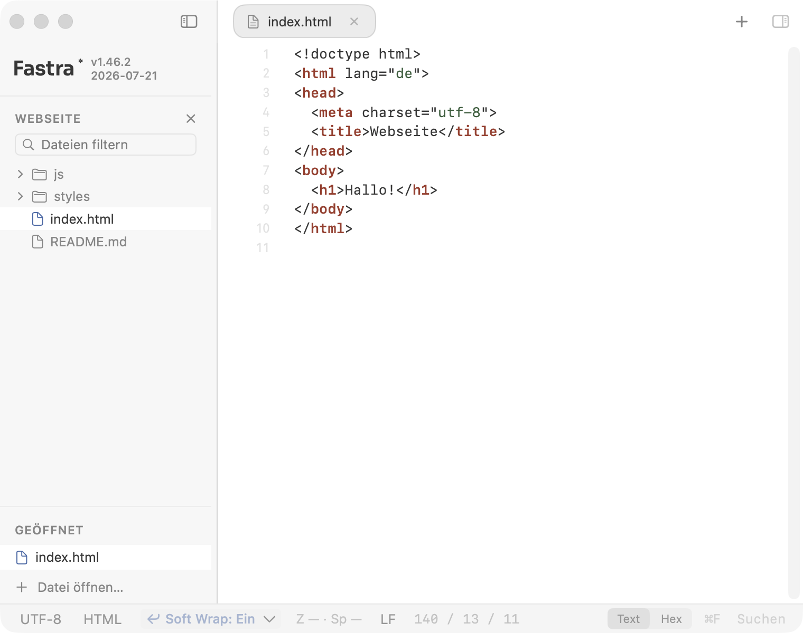
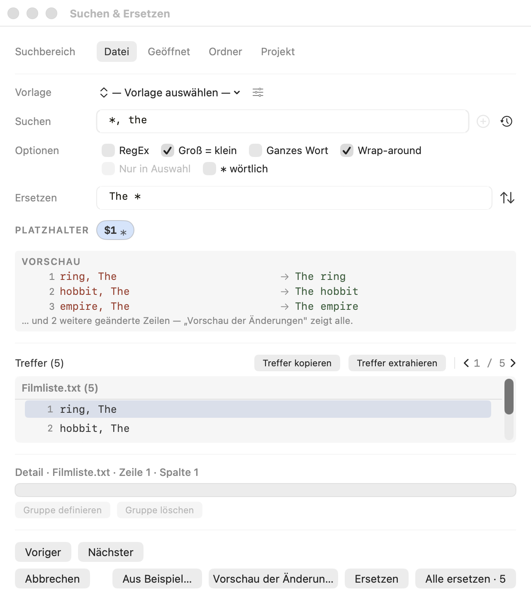
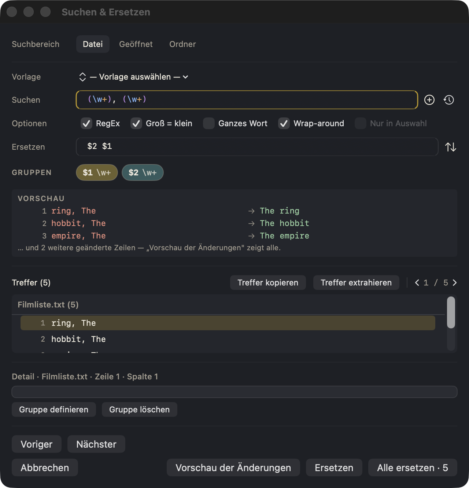
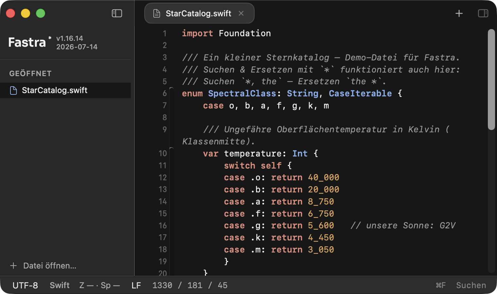

<p align="center">
  
</p>

# Fastra: Nativer Texteditor für macOS

**🌐 Sprache / Language:** [English](README.md) · [Deutsch](README.de.md)

Fastra ist ein nativer Texteditor für macOS mit Suchen-&-Ersetzen-Fähigkeiten,
die kein anderer Editor bietet: So einfach wie Tippen, so mächtig wie reguläre
Ausdrücke, und man sieht immer exakt, was sich ändern wird, bevor ein einziges
Zeichen angefasst wird.

*Der Name ist Programm: **f**acillime **ad astra**, „aufs Leichteste zu den
Sternen". Das Sternchen (`*`) ist der Star.*



## Download / Releases

Fertige Builds gibt es als DMG auf der
[Releases-Seite](https://github.com/DanielMuellerIR/fastra/releases):
DMG laden, öffnen und Fastra in den Programme-Ordner ziehen. Das DMG ist
mit einer Developer-ID signiert und von Apple notariell beglaubigt,
Gatekeeper öffnet es deshalb ohne Warnung. Version 1.19.0 muss einmal per DMG
installiert werden; danach findet **Fastra → Nach Updates suchen …** signierte
Releases direkt in der App. Voraussetzung: macOS 14+ (Apple Silicon).

## Das `*`-Sternchen: Mächtigkeit ohne Syntax

Alltägliche Umbau-Aufgaben sind in einem normalen Texteditor schlicht
unmöglich und mit RegEx überdimensioniert. Fastras Antwort ist das Sternchen:
**ein `*` fängt beliebigen Text**, und im Ersetzen-Feld verwendet man ihn
einfach wieder.

> Aus `ring, The` wird `The ring`, über eine ganze Liste hinweg:
> Suchen `*, The`, Ersetzen `The *`. Fertig. Kein RegEx, kein Nachschlagen,
> kein Risiko: Die Live-Vorschau zeigt jede Änderung, bevor sie angewendet wird.

<p align="center">
  
</p>

- Jedes `*` wird zur nummerierten, ziehbaren Fang-Pille. Text umstellen
  heißt: Pillen ins Ersetzen-Feld ziehen.
- `**` fängt über Zeilenumbrüche hinweg (ganze Blöcke zwischen zwei Markern).
- Das kann ein gewöhnlicher Texteditor **gar nicht**, und mit regulären
  Ausdrücken bräuchte es Syntax, die die meisten jedes Mal nachschlagen
  müssen. Mit Fastra ist es ein Tastendruck.

Und wenn eine Aufgabe wirklich die volle Kraft braucht, schaltet man den
RegEx-Modus ein: Token-Highlighting, kuratierte Vorlagen und geführte
Capture Groups.

<p align="center">
  
</p>

## Funktionen

- **Vorschau vor Apply**: Vorher/Nachher side-by-side für jede Operation;
  geschrieben wird erst nach Bestätigung.
- **`*`-Platzhalter-Suche** mit Capture-Semantik, ganz ohne RegEx-Kenntnisse.
- **Voller RegEx-Modus** mit farbigem Token-Highlighting und kuratierter Vorlagen-Bibliothek.
- **Capture Groups per Drag & Drop** vom Such- ins Ersetzen-Feld.
- **Bereiche**: Aktuelle Datei, alle offenen Tabs, Ordner oder eine konfigurierte
  Dateimenge im aktuellen Projekt.
- **Projekte, Git und Markdown** ergänzen den normalen Texteditor; die Details
  stehen unten.
- **Light- & Dark-Mode**, natives SwiftUI/AppKit, kein Electron.
- **Lokal & privat**: Keine Konten, Telemetrie, Dokument-Uploads oder Abos. Die
  Updateprüfung kontaktiert nur Fastras signierten GitHub-Pages-Feed und sendet
  kein Hardware- oder Systemprofil.



## Projekte und Git direkt im Editor

Beim Öffnen eines Ordners zeigt Fastra einen lebenden, hierarchischen Dateibaum.
Git-Repositories erkennt die App automatisch und merkt sie für den Startbildschirm.
Dabei bleiben sie ganz normale lokale Ordner: Fastra ist zuerst ein Texteditor,
nicht der Ersatz für einen vollwertigen Git-Client.

- Die Ansicht **Änderungen** trennt bereitgestellte von noch offenen Dateien.
  Einzelne Dateien lassen sich bereitstellen, aus der Bereitstellung nehmen oder
  nach Rückfrage verwerfen; ihr Diff öffnet sich im Editor. Darüber stehen
  Commit-Nachricht und Commit-Schaltfläche. Bei Konflikten aus Merge, Rebase,
  Cherry-pick oder Revert navigiert eine kompakte Leiste im normalen Editor
  durch die Konfliktblöcke, übernimmt obere, untere oder beide Seiten mit
  nativem Undo und markiert nur den verifizierten, gespeicherten Dateistand als
  gelöst. Binäre, von Git per Dateiattribut als binär klassifizierte oder nur
  abschnittsweise geladene Dateien erhalten eine ehrliche Grenze statt einer
  ungeeigneten Textauflösung.
- Die Ansicht **Graph** zeichnet Branches und Merges als nativen mehrspurigen
  Verlauf mit Branch- und Tag-Markierungen. Commits lassen sich aufklappen;
  ein Doppelklick auf Commit oder Datei öffnet den passenden Diff-Tab.
  Text-Patches können als schreibgeschützter Side-by-side-Diff mit ausgerichteten
  Zeilen, Intra-Zeilen-Hervorhebung, Faltungen, Übersichtsleiste und
  Tastaturnavigation zwischen Änderungsblöcken erscheinen. Binäre und kombinierte
  Patches bleiben über klare Metadaten beziehungsweise den auswählbaren
  Unified-Fallback zugänglich.
- In der Projekt-Seitenleiste stehen aktueller Branch, Ahead/Behind-Stand und
  Dateistatus. Fetch kann manuell oder bei aktiver App zeitgesteuert laufen;
  Alter und Fehler bleiben sichtbar. Pull verwendet immer eine gewählte Strategie
  (Rebase, Merge oder nur Fast-Forward), prüft das Repository unmittelbar vor
  dem Start erneut und versteckt weder automatischen Stash noch Push.
- Kuratierte Aktionen decken neuen Branch, Stash/Pop, Cherry-pick, Revert sowie
  Fortsetzen und Abbrechen eines laufenden Git-Vorgangs ab. Destruktive oder
  verlaufsändernde Wege besitzen eine frische Vorprüfung und Bestätigung. Force
  Push ist ausschließlich als exakte **Force-with-Lease**-Aktion verfügbar.
  Die Git-Identität lässt sich repository-lokal oder nach gesonderter Bestätigung
  global konfigurieren.
- **Im Terminal öffnen** übergibt den Projektordner an Terminal.app, ohne in
  Fastra einen Shell-Befehl zu konstruieren oder auszuführen.

Die Git-Funktionen sind eine schlanke, asynchrone Oberfläche für das installierte
`git`-Kommando. Fehlt Git, bleiben die zugehörigen Bedienelemente unsichtbar;
bei Fehlern zeigt Fastra die tatsächliche Git-Meldung statt einer unklaren
Ersatzmeldung. Repository-Vorgänge werden über Fastra-Fenster hinweg koordiniert,
damit kollidierende Befehle nicht übereinanderlaufen.

## Markdown bleibt lokal

Für Markdown-Dateien lässt sich rechts neben dem Editor eine optionale,
live aktualisierte Vorschau mit dauerhaftem Splitter einblenden. Der lokale
Renderer beherrscht GitHub-Flavoured Markdown, darunter Tabellen, Aufgabenlisten,
Durchstreichungen, syntaxhervorgehobene Code-Blöcke und Links. Er zeigt außerdem
lokale Bilder, TeX-Formeln in `$…$` oder `$$…$$` und Diagramme aus
`mermaid`-Code-Blöcken. Markierter Vorschau-Text lässt sich als Klartext, HTML
oder Rich Text kopieren, sofern das Zielprogramm es unterstützt.

Die Vorschau und ihre Render-Bibliotheken arbeiten ausschließlich lokal.
Bildpfade werden relativ zur Markdown-Datei aufgelöst; externe Bilder werden
bewusst nicht nachgeladen. Schon das Öffnen einer Datei erzeugt also keinen
stillen Netzwerkverkehr. Links öffnet Fastra nur nach einem bewussten Klick.

**Smart-Paste** wandelt formatierten Inhalt aus Browsern oder Office-Programmen
an der Cursorposition in sauberes Markdown um. Dafür nutzt Fastra das separat
installierte Kommandozeilenwerkzeug
[md-clip](https://github.com/DanielMuellerIR/md-clip); fehlt es, erklärt Fastra
die Installation.

## Mehr als Suchen & Ersetzen

Das Text-Menü bündelt Transformationen, für die man sonst zu den ganz großen
Editoren greifen muss. Die anspruchsvolleren darunter:

- **Case-Transformationen im Ersetzungsmuster** (`\U \L \u \l \E`):
  Groß-/Kleinschreibung direkt beim Ersetzen umformen.
- **Zeilen verarbeiten, die … enthalten**: Suchen & Ersetzen nur auf Zeilen
  anwenden, die einem Filter entsprechen.
- **Doppelte Zeilen verarbeiten**: Duplikate erkennen und transformieren oder
  einsammeln.
- **Treffer extrahieren**: Alle Fundstellen in ein neues Dokument ausleiten.
- **Zap Gremlins**: Unsichtbare und ungültige Zeichen aufspüren.
- **Unicode-Normalisierung** (NFC/NFD), Diakritika entfernen, gerade ⇄
  typografische Anführungszeichen, Escape-Sequenzen.
- Zeilen sortieren/verbinden/deduplizieren, harter Umbruch, Zeilennummern
  hinzufügen/entfernen, Wörter tauschen sowie JSON oder XML formatieren.
- **Transformation per Beispiel** leitet aus Vorher/Nachher-Text ein
  Platzhalter-Muster ab; eigene Suchvorlagen lassen sich speichern,
  importieren und exportieren.
- Große und binäre Dateien bleiben beherrschbar, unter anderem mit einer
  schreibgeschützten Hex-Ansicht und einem ausdrücklich aktivierten Edit-Modus.

Fastra bleibt dabei bewusst zugänglich: Es gibt Editoren mit noch mehr
Maschinerie, und mit entsprechender Lernkurve. Fastra deckt die Alltagsfälle
ab, ohne dass man ein Handbuch braucht.

### Syntax-Highlighting

Tree-sitter-basiertes Highlighting für 26 Sprachen und Dateiformate: Bash, C,
C++, C#, CSS, Dart, Dockerfile, Go (inkl. go.mod), HTML, Java, JavaScript/JSX,
JSON, Kotlin, Lua, Markdown, Objective-C, Perl, PHP, Python, Ruby, Rust, SQL,
Swift, TOML, TypeScript/TSX und YAML. Alles andere öffnet als reiner Text.

## Voraussetzungen & Installation

- macOS 14+ (Apple Silicon)
- DMG aus den [Releases](../../releases) laden, Fastra nach `/Programme`
  ziehen, fertig.
- Ab Version 1.19.0 stehen künftige signierte Releases unter
  **Fastra → Nach Updates suchen …** bereit und werden erst nach Zustimmung installiert.

### Aus dem Quellcode bauen

```bash
cd app
./build.sh release   # Bundle landet in app/dist/
./selftest.sh        # Unit-Tests + In-App-Selbsttests
```

Details: [app/README.md](app/README.md) · [CLAUDE.md](CLAUDE.md) (Build, Tests, QA)
· [AGENTS.md](AGENTS.md) (Architektur & Produktprinzipien) ·
[ROADMAP.md](ROADMAP.md) · [CHANGELOG.md](CHANGELOG.md)

## Lizenz

[MIT](LICENSE), © 2026 Daniel Müller

Fastra bündelt und linkt Drittsoftware (Sparkle, ripgrep, PCRE2, die CodeEdit- und
tree-sitter-Komponenten, cmark-gfm sowie die Markdown-Vorschau-Assets). Deren
Lizenzen und Copyright-Vermerke sind in
[THIRD-PARTY-NOTICES.md](THIRD-PARTY-NOTICES.md) gesammelt.
