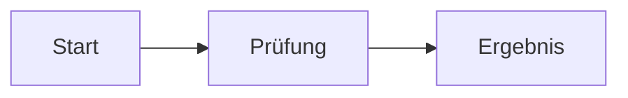

# Fastra-Hilfe

Fastra ist ein nativer macOS-Texteditor für sichere, visuell überprüfbare
Suche und Ersetzung über Dateien und Ordner. Der Kern: **Vor jeder
Mehrfachänderung siehst du eine vollständige Vorschau** — Fastra schreibt
nie in Dateien, ohne dass du die Auswirkungen vorher gesehen hast.

## Dokumente und Speichern

⌘T öffnet einen neuen Tab. Beim ersten Speichern schlägt Fastra den Ordner
der Datei vor, die unmittelbar vorher aktiv war — auch wenn du erst Text
einfügst oder den neuen Tab leer speicherst. Ein bewusst in der Seitenleiste
markierter Ordner hat Vorrang; ohne Dokumentkontext dient der Projektordner
als Rückfall.

„Speichern unter…“ ergänzt bei neuen Text- und Markdown-Dokumenten `.txt`
beziehungsweise `.md`. Das Format-Menü bietet alle mitgelieferten
Syntaxsprachen sowie CSV und XML und setzt beim Wechsel die passende Endung.
Eine beliebige eigene Endung kannst du weiterhin direkt im Namensfeld eingeben.

## Suchen und Ersetzen

⌘F öffnet die Suchmaske im Datei-Bereich, ⇧⌘F im Ordner-Bereich; ⌘E übernimmt
die aktuelle Auswahl als Suchbegriff. Ist die Maske bereits offen und das
Suchfeld befüllt, holen ⌘F und ⇧⌘F sie nur nach vorn — der gewählte Bereich und
die Treffer bleiben erhalten; der Menüpunkt „In Ordnern suchen…“ wechselt
dagegen immer in den Ordner-Bereich. Die Suche läuft **live beim Tippen**. In
der Trefferliste steht hinter jedem Fund der restliche Zeileninhalt als
Kontext; bei sehr langen Zeilen endet er nach rund 400 Zeichen mit „…“. Im
gerade sichtbaren Dokument werden die ersten 2 000 Treffer sofort farbig
markiert — im Ordner- und Projekt-Bereich nur, solange der geöffnete Tab
ungeändert zur durchsuchten Dateifassung passt.

**Suchbereiche** (oben in der Maske):

- **Datei** — der aktive Tab.
- **Geöffnet** — alle offenen Tabs (auch ungespeicherte).
- **Ordner** — die aktivierten Ordner auf der Platte. Die Live-Suche
  startet ab 3 Zeichen; „Suchen“ bzw. Return erzwingen sie jederzeit.
- **Projekt** — der Projektordner, eingeschränkt über Datei-Sets und
  Ausschlussmuster.

**Projekt-Ausschlüsse:** Mehrere Muster werden durch Kommas getrennt. Ein
einfaches Punkt-Suffix wie `.json` ist die Kurzform für `*.json`; ausdrückliche
Globs wie `userPreferences.*`, `foo?.txt` und `**` bleiben unverändert.
Ordner-Treffer schließen den ganzen Unterbaum aus, Slash-Muster beziehen sich
auf die Projektwurzel. Groß-/Kleinschreibung wird wie eingegeben beachtet.
`DerivedData` bleibt bei jeder Projekt-Suche unabhängig von der Tiefe
verbindlich ausgeschlossen und wird deshalb auch unter dem Eingabefeld
angezeigt. Änderst du Suchbegriff, Dateityp oder Ausschlüsse, entfernt Fastra
die alte Trefferliste sofort; Navigation, Vorschau und „Alle ersetzen“ werden
erst mit dem Ergebnis des neuen Laufs wieder aktiv.

**Platzhalter (Wildcards):** Ohne RegEx-Modus steht `*` für beliebigen
Text **innerhalb einer Zeile**, `**` auch **über Zeilengrenzen hinweg**.
Jeder Platzhalter wird automatisch zu einer Capture-Gruppe: Die Pillen
(`$1`, `$2` …) unter dem Ersetzen-Feld lassen sich **anklicken oder per
Drag-and-drop** ins Ersetzen-Feld ziehen. Beispiel: Suchen `*, the`,
Ersetzen `The *` macht aus „ring, The“ → „The ring“. Der immer sichtbare
Schalter „∗ wörtlich“ behandelt `*` als normales Zeichen. Er ist nur aktiv,
wenn RegEx aus ist und der Suchausdruck mindestens ein `*` enthält.

**RegEx:** Der RegEx-Schalter aktiviert reguläre Ausdrücke
(ICU-Syntax, wie `NSRegularExpression`). Capture-Gruppen erscheinen
ebenfalls als Pillen. „Aus Beispiel…“ leitet ein Muster aus einem
Vorher/Nachher-Beispiel ab.

**Optionen:** Groß-/Kleinschreibung, „Ganzes Wort“, „Wrap-around“ und
„Nur in Auswahl“ (sucht ausschließlich in der eingefrorenen Selektion).

**Ersetzen:**

- „Ersetzen“ ersetzt nur den aktiven Treffer und springt weiter.
- „Alle ersetzen · N“ (⌘Return) ersetzt alle Treffer des Suchbereichs.
- „Vorschau der Änderungen“ zeigt vor dem Ersetzen jede betroffene Zeile
  als Vorher/Nachher-Diff. Angewendet wird **exakt** die angezeigte
  Trefferbasis — das ist eine Sicherheitsgarantie.
- Im Ordner-/Projekt-Bereich prüft Fastra vor dem ersten Schreiben noch einmal
  alle Dateien gegen die sichtbare Vorschau. Geänderte Dateien und betroffene
  Tabs mit ungespeicherten Änderungen blockieren den gesamten Vorgang. Planung,
  Backup und Schreiben laufen mit Fortschrittsanzeige im Hintergrund; ein
  Abbruch vor der kurzen Schreibphase verändert keine Zieldatei. Eine Datei,
  bei der die Ersetzung genau denselben Text ergibt, wird übersprungen — es
  gibt für sie nichts zu schreiben. Abgelehnt wird der Vorgang nur, wenn sich
  keine einzige Datei ändert.
- Fastra schreibt atomar pro Datei und legt automatisch ein Backup an.
  „Rückgängig“ spielt nur tatsächlich angewendete Dateien bit-exakt zurück und
  bricht ab, wenn sich eine davon nach dem Ersetzen erneut geändert hat.

**Navigation:** Return bzw. ⌘G springt zum nächsten, ⇧⌘G zum vorherigen
Treffer; die Pfeiltasten wandern durch die Trefferliste, die dabei zum
aktiven Treffer scrollt. Der Editor zentriert die Zielzeile soweit es der
Dokumentrand erlaubt und hebt sie bei offener Suchmaske zusätzlich deutlich
farbig hervor. Die Zeilenhervorhebung bleibt auch über der Auswahl eines
Treffers sowie bei normalen mehrzeiligen oder rechteckigen Auswahlen sichtbar;
es wird dabei immer nur eine aktive Auswahlzeile betont. Escape blendet die
Maske aus.

## Dateien vergleichen

**Suchen → Dateien vergleichen…** (⌃⌘D) stellt zwei Dateien nebeneinander —
ganz ohne Git. Links und rechts lassen sich per Auswahl-Dialog, per
Drag-and-drop oder aus offenen Tabs und zuletzt geöffneten Dateien belegen;
der aktive Tab ist links vorbelegt.

- **Zwei offene Tabs vorwählen:** Erst den aktuellen Dokument-Tab festlegen,
  dann mit gedrückter Shift-Taste einen zweiten normalen Text-Tab anklicken.
  Der aktuelle Tab bleibt mit der stärkeren grauen Fläche eindeutig aktiv;
  der Vergleichspartner erscheint schwächer grau. Im Rechtsklickmenü eines
  der beiden Tabs öffnet „Dateien vergleichen…“ den Dialog mit beiden
  Dokumenten bereits links und rechts ausgewählt. Ein weiterer Shift-Klick
  ersetzt bzw. entfernt den Partner, ein normaler Tab-Klick hebt die
  Paar-Auswahl auf.
- **Optionen:** Leerraum am Zeilenende, alle Leerraum-Unterschiede,
  Leerzeilen sowie Groß-/Kleinschreibung lassen sich beim Vergleich
  ignorieren. Aktive Optionen stehen sichtbar im Kopf der Ansicht.
- **Differenzen-Liste:** Unter dem Diff listet Fastra jeden Unterschied
  („Zeilen 12–14 geändert“, „Zeile 30 nur links“). Ein Klick springt
  dorthin; ⌥↑/⌥↓ wandern zum vorigen/nächsten Unterschied.
- **Lange gleiche Abschnitte** sind eingeklappt und lassen sich pro
  Abschnitt einblenden.
- **Mit gespeicherter Fassung vergleichen** vergleicht den ungespeicherten
  Editor-Inhalt des aktiven Tabs direkt mit dem Stand auf der Platte —
  praktisch vor dem Speichern.
- Identische Dateien meldet Fastra ausdrücklich; binäre, fehlende oder
  extrem große Dateien erklären sich mit einer verständlichen Meldung
  statt eines irreführenden Diffs.

Der Vergleich zeigt nur an — er ändert nie Dateien.

## Text-Transformationen

Alle Transformationen wirken auf die Selektion — ohne Selektion auf das
ganze Dokument. Erreichbar über das Menü **Text** und das
Rechtsklickmenü im Editor.

- **Buchstaben:** GROSSBUCHSTABEN, kleinbuchstaben, Wörter Groß.
- **Whitespace:** Leerzeichen am Zeilenende entfernen, Tabs → Leerzeichen,
  Leerzeichen → Tabs, Einrücken, Ausrücken, Zeilen hart umbrechen…
- **Zeilen:** alphabetisch auf-/absteigend sortieren, Zeilen umkehren,
  Leerzeilen entfernen, Zeilen verbinden (mit/ohne Leerzeichen),
  Präfix/Suffix an Zeilen…, Zeilennummern hinzufügen/entfernen, Nur Zeilen
  mit Treffer behalten…, Zeilen mit Treffer löschen…, Nur doppelte Zeilen
  behalten, Mehrfach vorkommende Zeilen entfernen.
- **Zeichen:** Steuerzeichen entfernen, Anführungszeichen gerade richten,
  Anführungszeichen schwungvoll (englisch), Escape-Sequenzen auflösen,
  Zeichen tauschen, Wörter tauschen.
- **Unicode:** Leerzeichen vereinheitlichen, Diakritische Zeichen
  entfernen, Unicode zusammensetzen (NFC), Unicode zerlegen (NFD),
  Emoji-Darstellung erzwingen bzw. aufheben (U+FE0F).

**Emoji-Darstellung erzwingen** hängt an Zeichen, die erst mit dem
Variantenselektor U+FE0F farbig erscheinen, genau diesen Selektor an — aus `⏸`
wird `⏸️`. Danach zeigt nicht nur Fastras Editor, sondern auch die Vorschau,
der Browser, GitHub oder Keynote das farbige Symbol. Unangetastet bleiben
Zeichen, die schon farbig sind (🎶), die Schriftzeichen `©`, `®`, `™`, `‼` und
`⁉` sowie `#`, `*` und Ziffern — sie würden sonst zu Symbolen. Zweimal
anwenden ändert nichts mehr; **Emoji-Darstellung aufheben** ist der Rückweg.

Der sichtbare Schalter **Formatieren** in der Fußzeile sowie der Befehl
**Dokument formatieren** im Menü **Text** und im Rechtsklickmenü rücken
JSON/XML hübsch ein. Der Schalter bleibt im Textmodus sichtbar und erklärt
dort, dass zuerst JSON oder XML gewählt werden muss. Ebenfalls im Menü:
**Dokument prüfen**
(Syntaxprüfung mit Fehlerposition) und **Dokument minifizieren**. Formatieren
und Minifizieren folgen dem **effektiven Dokumentformat**: Automatisch werden
`json`, `xml`, `xsd`, `xsl`, `xslt` und `plist` unterstützt; nach einer
manuellen Wahl von **JSON** oder **XML** im Sprach-Chip funktionieren die
Befehle auch in einer `.txt`-Datei oder einem ungespeicherten Tab. Große
Formatierungen laufen im Hintergrund und werden nur übernommen, solange
Dokument und Auswahl unverändert sind. Die Prüfung folgt weiterhin der
Dateiendung und unterstützt zusätzlich `svg` und die 4D-Containerdateien.

## Gehe zum Ziel

**Alt-Doppelklick** auf einen Namen springt zur Definition — nach dem
Vorbild des 4D-Methodeneditors:

- **4D (`.4dm`):** Ein Methodenname öffnet die Projektmethode
  (`Project/Sources/Methods/…`), ein Klassenname die Klassendatei;
  `Function`-Definitionen in der aktuellen Klassendatei springen lokal.
  Ist nichts davon auffindbar, öffnet Fastra die Projektsuche mit dem
  Namen — nie ein stiller Fehlschlag.
- **Markdown:** Relative Dateipfade in Links/Bildern öffnen im Editor,
  `http(s)`-/`mailto`-Adressen im Browser, `#anker` springen zur
  Überschrift in der Datei.

Die Alt-Drag-Spaltenauswahl bleibt unberührt (sie beginnt mit einem
Einzelklick). Nicht auflösbare Ziele melden sich mit einem kurzen
Aufblitzen und einem Hinweis in der Seitenleiste.

## Ansichten: Text, Vorschau, Hex

Der Umschalter rechts in der Fußzeile erscheint, sobald eine Datei mehr
als eine Ansicht bietet:

- **Text** — der normale Editor.
- **Vorschau** — Markdown gerendert, Bilder, PDFs und SVGs dargestellt.
- **Hex** — der gespeicherte Stand der Datei als Hexdump; ungespeicherte
  Änderungen des Text-Tabs sind dort nicht enthalten. Binärdateien
  öffnen direkt in der Hex-Ansicht, sehr große Textdateien in einer
  abschnittsweisen Ansicht.

Die Hex-Ansicht ist zunächst schreibgeschützt. **Bearbeiten erlauben** schaltet
die Eingabe erst nach einer Warnung frei; **Vorschau & Speichern…** zeigt danach
jede geplante Byte-Änderung und fragt ein zweites Mal. Vor dem atomaren
Speichern prüft Fastra die angezeigten Altwerte erneut. Hat ein anderes Programm
eines dieser Bytes inzwischen geändert, bricht Fastra ab und lässt die Datei
sowie die sichtbare Änderungsliste unangetastet. Auch sehr große Binärdateien
werden dabei nur abschnittsweise im Hintergrund verarbeitet.

## Markdown

Bei Markdown-Dokumenten zeigt die geteilte Ansicht rechts die gerenderte
Vorschau — bei einer `.md`-Datei automatisch, sonst sobald du das Format
im Sprach-Chip der Fußzeile auf Markdown stellst: Tabellen, Codeblöcke mit Syntaxfarben, Formeln (KaTeX) und
Mermaid-Diagramme — vollständig lokal, ohne Netzzugriff. Ein **Klick in
die Vorschau** springt im Editor zur passenden Quellzeile. Umgekehrt richtet
ein **Klick in den Quelltext** die Vorschau möglichst an derselben Stelle aus.
Kopieren aus der Vorschau liefert echten Rich-Text (Überschriften, Listen, Fettung
bleiben erhalten). Aus dem Editor kopiert Fastra dagegen immer reinen Text:
ohne Schrift und Farbe und ohne dass ein Zielprogramm beim Umwandeln etwas
verändern kann.

**Symbole, die in der Vorschau schmal aussehen:** Manche Zeichen sind laut
Unicode Textzeichen und werden erst mit einem angehängten Variantenselektor
(U+FE0F) zum farbigen Emoji — zum Beispiel `⏸`, `⏹` oder `▶`. Der Editor zeigt
sie trotzdem farbig, weil macOS für sie nur die Emoji-Schrift besitzt; die
Vorschau folgt der Unicode-Regel und zeigt die schmale Textform, genau wie
Browser, GitHub oder Keynote. Fastra verändert die Datei dabei nicht. Soll das
Symbol überall farbig erscheinen, muss der Variantenselektor im Text stehen —
dafür gibt es **Text → Emoji-Darstellung erzwingen (U+FE0F)**.

### Besondere Vorschau-Syntax

Fastra verwendet GitHub-Flavoured Markdown und ergänzt es in der Vorschau um
die folgenden lokalen Darstellungen.

**Sichtbare Leerzeilen:** Eine Quellzeile ausschließlich aus mindestens zwei
normalen ASCII-Leerzeichen (`U+0020 U+0020`) erscheint als genau eine
vollständig leere Textzeile. Im folgenden Beispiel steht `␠` zur Erklärung für
ein normales Leerzeichen; die Zeichen `␠` werden nicht mit eingegeben:

```text
Erster Absatz
␠␠
Zweiter Absatz
```

Eine leere Zeile oder genau ein Leerzeichen folgt weiterhin CommonMark. Zwei
Leerzeichen am Ende einer **nichtleeren** Zeile und ein Backslash bleiben
normale harte Umbrüche. In eingerückten oder mit Backticks/Tilden begrenzten
Codeblöcken gilt die Erweiterung nicht. Beim Kopieren wird die sichtbare
Leerzeile als normaler Zeilenumbruch übernommen.

**Textmarker:** Text zwischen zwei Gleichheitszeichen-Paaren wird mit einem
festen, zum hellen oder dunklen Erscheinungsbild passenden Hintergrund
hervorgehoben, zum Beispiel `==wichtig==`. Andere Markdown-Auszeichnungen
können darin verschachtelt werden; in Inline-Code und Codeblöcken bleiben die
Gleichheitszeichen wörtlich. Diese Schreibweise ist eine Fastra-Erweiterung und
gehört nicht zum GFM-Standard.

**Formeln (KaTeX):** Formeln stehen inline zwischen einzelnen Dollarzeichen,
zum Beispiel `$E = mc^2$`. Ein eigener Formelblock beginnt und endet mit je
zwei Dollarzeichen:

```text
$$
\int_0^1 x^2\,dx = \frac{1}{3}
$$
```

**Mermaid-Diagramme:** Ein Codeblock mit der Sprache `mermaid` wird als Diagramm
gerendert. Andere Codeblöcke bleiben normaler, syntaxhervorgehobener Code:

````markdown

````

KaTeX und Mermaid werden aus der App geladen und vollständig lokal ausgeführt;
die Vorschau benötigt dafür keinen Netzzugriff.

### Was die Vorschau nicht tut

Die Vorschau stellt ein Dokument dar, das jemand anderes geschrieben hat —
sie sieht aus wie ein harmloses Abbild der Datei und ist keins. Deshalb geht
sie nie ins Netz: `default-src 'none'`, entfernte Bilder werden neutralisiert,
lokale laufen über interne Tokens. Skripte laufen nicht, und Link-Schemata, die
ausführen statt zu navigieren (`javascript:`, `vbscript:`, `file:`, `data:`),
verwirft Fastra.

Ganz ohne HTML ginge es nicht: Der verbreitetste README-Aufbau ist ein
zentriertes Logo als `<p align="center"></p>`. Fastra rendert deshalb
eine kleine, feste Menge an Elementen — Absätze, Auszeichnungen, Listen,
Tabellen, `<a>`, ``, `<details>`/`<summary>` — und baut die Ausgabe dabei
neu auf, statt Eingabebytes durchzureichen.

Bei Werkzeugen, die Markdown schnell anzeigen, ist das nicht selbstverständlich.
Zwei Muster sind verbreitet: Entfernte Bilder werden geladen, wie sie
dastehen — wer die Datei geschickt hat, erfährt damit, dass und ungefähr wann
Sie sie geöffnet haben. Und Formel- oder Diagrammbibliotheken kommen beim
Anzeigen von einem öffentlichen CDN. Beides ist nicht bösartig und meist
umstellbar, aber selten sichtbar. Nachprüfen können Sie es bei jedem Werkzeug
selbst: ein Dokument mit einem entfernten Bild öffnen und die ausgehenden
Verbindungen beobachten.

## Markdown schreiben

Bei Markdown-Tabs erscheint über dem Editor eine **Format-Toolbar**; die
gleichen Befehle liegen im Menü „Markdown“ und im Rechtsklickmenü. Sie
wirken als normale, mit ⌘Z widerrufbare Textänderungen auf die Auswahl
bzw. die Cursor-Zeile: Fett (⌘B), Kursiv (⌘I), Hervorheben (⇧⌘H),
Code (⇧⌘K),
Überschrift 1–3 (⌘⌥1–3), zurück zu normalem Text (⌘⌥0), Aufzählung
(⇧⌘8), nummerierte Liste (⇧⌘7), Zitat (⇧⌘9), Link (⌘K) und
„Tabelle einfügen…“ (kleiner Dialog: Spalten, Kopfzeile ja/nein).

Der Toolbar-Befehl **Harter Zeilenumbruch** fügt am Ende der Auswahl zwei
normale Leerzeichen und anschließend einen normalen Zeilenumbruch ein. Steht
der Cursor bereits direkt vor einem Zeilenumbruch, ergänzt bzw. vereinheitlicht
er nur die zwei Leerzeichen. So bleibt die zugrunde liegende Markdown-
Schreibweise sichtbar und mit ⌘Z widerrufbar.

**Formatiert als Markdown einfügen** (⇧⌘V) wandelt HTML- oder RTF-Inhalt aus
Browsern und Office-Programmen mit dem separat installierten Werkzeug
`md-clip` um. Fastra bindet Fenster, Tab, Editor und Auswahl beim Start der
Umwandlung. Wechselst du währenddessen das Ziel oder bearbeitest den Inhalt,
wird kontrolliert abgebrochen und nichts in ein anderes Dokument eingefügt.

**Bilder einfügen:** Ein Bild aus der Zwischenablage (⌘V) legt Fastra
als Datei im Unterordner `images` ab
(`dokumentname-JJJJ-MM-TT-hhmmss.png`; PNG/JPEG/GIF behalten ihr Format,
alles andere wird PNG) und verlinkt es relativ an der Cursorposition. Eine
**Bilddatei per Drag-and-drop** wird unter ihrem ursprünglichen Dateinamen
unverändert in denselben Unterordner kopiert
(Namenskollision → Suffix; byte-identische Datei wird nicht doppelt
abgelegt) und ebenfalls relativ verlinkt — andere Dateien öffnen wie gewohnt
in einem Tab. Beim Ziehen zeigt der Editor die Einfügemarke an der wirklichen
Textposition; am oberen und unteren Rand scrollt das Dokument weiter. Nach dem
Einfügen scrollt die Vorschau zur Einfügestelle. Ungespeicherte Dokumente
haben noch keinen Ordner — deshalb zuerst speichern (⌘S).

⌘Z entfernt bei einem solchen Paste oder Drop sowohl den Link als auch die
dabei neu von Fastra erzeugte Bilddatei; Wiederholen stellt beides wieder her.
Eine bereits vorhandene oder selbst im Dateisystem abgelegte und manuell
verlinkte Datei wird nie entfernt.

Fastra veröffentlicht eine Bilddatei erst nach der vollständigen Kopie und
überschreibt keine gleichzeitig entstandene Datei. Wird der echte
`images`-Ordner währenddessen durch einen symbolischen Link ersetzt, bricht
die Ablage ab und schreibt nichts ins Linkziel.

### HTML in der Vorschau

Markdown-Dateien enthalten oft etwas HTML — am häufigsten ein zentriertes Bild
am Anfang eines README. Die Vorschau zeigt davon eine bewusst kleine Auswahl:
Absätze, Textauszeichnungen, Listen, Tabellen, Links, Bilder sowie
`<details>`/`<summary>`.

Alles andere wird stillschweigend weggelassen, darunter `<script>`, `<style>`,
`<iframe>` und `<svg>`, außerdem sämtliche Ereignis-Attribute und die Angaben
`style`, `class` und `id`. Damit kann eine fremde Datei in der Vorschau nichts
ausführen, nichts nachladen und sich auch nicht über die Darstellung legen.
Passt an einem HTML-Abschnitt etwas nicht in dieses enge Raster, entfällt der
ganze Abschnitt — lieber sichtbar zu wenig als unbemerkt zu viel.

Bilder aus solchen HTML-Abschnitten werden wie Markdown-Bilder behandelt:
lokale Dateien erscheinen, entfernte Adressen werden nicht geladen. Das Öffnen
einer Markdown-Datei erzeugt also weiterhin keinen Netzverkehr.

## Dokumente in Markdown umwandeln

Ist das separat installierte Werkzeug **Poor Man's Text** vorhanden, kann Fastra
ganze Dokumente in Markdown umwandeln. Öffnest du eine erkannte Datei — je nach
Stand des Werkzeugs etwa `.rtf`, `.rtfd`, `.docx`, `.odt` oder `.doc` —,
erscheint über dem Editor der Hinweis **In Markdown umwandeln**. Denselben
Befehl findest du im Menü **Ablage** und im Rechtsklickmenü der Projekt-
Seitenleiste. Fastra wandelt nichts von selbst um: Der Klick auf den Befehl ist
die Zustimmung.

Es läuft appweit höchstens eine Umwandlung. In einem zweiten Fenster bleibt das
eigene Angebot sichtbar, erklärt aber den laufenden Vorgang und ist bis zu
dessen Abschluss nicht anklickbar.

Ein `.rtfd`-Dokument ist im Finder ein Ordner. Fastra fragt deshalb nach, ob
es umgewandelt oder als Ordner geöffnet werden soll — sowohl beim Öffnen als
auch beim Klick darauf in der Projekt-Seitenleiste.

**Wo das Ergebnis landet:** direkt neben dem Original. Entstand nur Text, als
`Name.md`. Wurden Bilder mit herausgelöst, als Ordner `Name` mit `Name.md` und
einem Unterordner `images`. Ist der Name schon belegt — zum Beispiel weil
`Bericht.rtf` und `Bericht.docx` nebeneinanderliegen —, weicht Fastra auf
`Bericht-2` aus. Vorhandene Dateien werden nie überschrieben, und das
Originaldokument bleibt unverändert.

Die Umwandlung ist bewusst verlustbehaftet: Markdown kann Struktur, Links,
einfache Auszeichnungen, Listen und Bilder erhalten, aber nicht jede Schrift und
kein Layout. Meldet das Werkzeug solche Verluste, stehen sie nach der Umwandlung
in der Leiste über dem Editor.

**Welche Formate angeboten werden**, fragt Fastra beim Start direkt bei Poor
Man's Text ab und merkt sich die Antwort fünf Minuten. Kann das Werkzeug später
mehr Formate, nutzt Fastra sie ohne eigenes Update — hast du gerade
aktualisiert und willst nicht warten, starte Fastra neu. Fehlt das Werkzeug
selbst, wird schlicht nichts angeboten. Ist es installiert, fehlt aber ein von
ihm benötigtes Zusatzprogramm (meist Pandoc), sagt Fastra das offen: Die Leiste
über dem Editor beziehungsweise die Rückfrage beim `.rtfd`-Ordner erklärt, was
fehlt — Pandoc installierst du im Terminal mit `brew install pandoc` und
startest Fastra danach neu.

## Sprachen und Syntaxfarben

Fastra erkennt die Sprache an der Dateiendung, bei endungslosen Dateien
am Inhalt. Der Sprach-Chip in der Fußzeile öffnet das Sprachmenü: Die
manuelle Wahl gewinnt immer vor der Automatik, „Automatisch“ kehrt zu
ihr zurück.

Die manuelle Wahl merkt sich Fastra **für diese Datei**. Beim nächsten
Öffnen erscheint sie wieder in diesem Format — das ist vor allem für
Dateien ohne Endung wichtig, bei denen die Automatik nichts erkennen kann.
„Automatisch“ löscht den gemerkten Eintrag wieder. Umbenennen und
„Speichern unter“ nehmen den Eintrag an den neuen Pfad mit.

Die Wahl steuert auch die Markdown-Funktionen: Stellst du eine Datei auf
**Markdown**, öffnet sich die Vorschau und die Format-Toolbar erscheint;
wechselst du auf ein anderes Format, schließt sich die Vorschau wieder.

## Soft Wrap

Der kompakte **Soft-Wrap-Schalter** steht in der Fußzeile direkt neben
dem Sprach-Chip. Er zeigt **Ein** oder **Aus** sichtbar an; ein Hauptklick
schaltet sofort um. Der separate Pfeil und ein Rechtsklick öffnen dieselben
Optionen. **Darstellung → Soft Wrap** (⇧⌘L) schaltet denselben Wert.

Soft Wrap wird **pro effektivem Dokumentformat** gespeichert und gilt
appweit für alle offenen und später geöffneten Dokumente dieses Formats.
Eine manuelle Sprachwahl bestimmt deshalb auch, welches Formatprofil gilt.
Im Optionsmenü entfernt „Für … auf Werkseinstellung zurücksetzen“ nur die
eigene Abweichung des aktuellen Formats.

Als **Umbruchziel** stehen Fensterbreite, die Seitenlinie (Page Guide) und
eine feste Spalte zur Wahl. Für feste Breiten gibt es die Vorgaben 72, 80,
100 und 120 sowie eine freie Eingabe von Spalte 20 bis 500. Die Zielwahl
schaltet Soft Wrap zugleich ein. Ist das Fenster schmaler als das gewählte
Ziel, wird am Fensterrand umbrochen.

Die **Seitenlinie** ist davon unabhängig einblendbar: im Soft-Wrap-
Optionsmenü, unter **Darstellung → Seitenlinie anzeigen** oder in den
Einstellungen unter **Editor**. Ihre appweite Spalte lässt sich dort
ebenfalls wählen; Vorgabe ist 80. Beim Umbruch bevorzugt Fastra
Wortgrenzen. Ein einzelnes langes Wort wird zeichenweise umbrochen, ohne
ein Unicode-Zeichen zu zerlegen.

Werkseitig ist Soft Wrap für **Reinen Text, JSON, Markdown, HTML und XML ein**.
Für **4D, CSV und andere Code-/Konfigurationsformate ist es aus**.
Eine `.txt`-Datei ohne gespeicherte eigene Abweichung öffnet deshalb mit
Soft Wrap am Fensterrand. Das bleibt auch so, wenn für sie JSON als Format
gemerkt ist.
Auch ein mehrere MiB großes Dokument mit einer einzigen logischen Zeile kann
mit Soft Wrap geöffnet, gescrollt und bearbeitet werden; Fastra hält dafür nur
den sichtbaren Ausschnitt als Editor-Views vor. Es gibt keine automatische
Abschaltung oder Sperre. Ohne Soft Wrap bleiben lange Zeilen über den
horizontalen Scrollbalken erreichbar. Das Umschalten ändert weder Text noch
Auswahl, Rückgängig-Verlauf oder gespeicherte Datei. Die oberste angezeigte
Textzeile bleibt dabei ruhig an derselben Stelle.

## Einrückung

Im selben Optionsmenü steht das **Einrückungsprofil** des Formats: Die
Tab-Taste fügt wahlweise einen **Tabulator** oder **2, 3, 4 oder 8
Leerzeichen** ein; die **Tabbreite** bestimmt, wie breit ein Tabulator
dargestellt wird. Werkseinstellung sind vier Leerzeichen bei Tabbreite
vier. Auch dieses Profil gilt **pro Dokumentformat**, sofort für alle
offenen Dokumente und über Neustarts hinweg; „Für … auf Werkseinstellung
zurücksetzen“ nimmt es mit zurück.

Dasselbe Profil verwenden **Einrücken/Ausrücken** (Textmenü und
Rechtsklick), **Tabs in Leerzeichen/Leerzeichen in Tabs** und die
automatische Einrückung nach Return. Eine Profiländerung formatiert
bestehenden Text **nie** automatisch um — sie wirkt erst beim nächsten
Tippen oder Befehl.

**Bearbeiten → Einfügen und Einrückung angleichen** (⌥⇧⌘V) fügt den
Text der Zwischenablage so ein, dass er auf der Einrückung der Zielzeile
sitzt: Die gemeinsame Grund-Einrückung des kopierten Blocks wird entfernt,
die relative Verschachtelung bleibt erhalten, und das Ergebnis wird in
Tabs bzw. Leerzeichen des aktiven Profils ausgedrückt. Ist die Zielzeile
leer, zählt die zuletzt davor stehende nicht leere Zeile. Leerzeilen des
Blocks bleiben leer, der Zeilenendungsstil des Dokuments bleibt erhalten,
und die gesamte Einfügung ist eine einzige Rückgängig-Aktion. Bei einer
aktiven Rechteck- oder Mehrfachauswahl erklärt der Befehl sichtbar, dass
er dort nicht wirkt.

## Rechteckauswahl

Mit **Alt-Drag** markiert Fastra denselben Spaltenbereich über mehrere
**logische Textzeilen**. Das funktioniert auch bei Soft Wrap: Eine lange
Zeile bleibt genau eine Rechteckzeile, selbst wenn sie sichtbar über mehrere
Umbruchfragmente läuft. Kurze und leere Zeilen, Tabs, CRLF und
zusammengesetzte Unicode-Zeichen werden nicht künstlich zerlegt.

**Kopieren, Ausschneiden, Löschen, Tippen und normales Einfügen** wirken auf
alle Teilbereiche. Eine einzelne Clipboard-Zeile füllt jede Rechteckzeile;
mehrere Clipboard-Zeilen werden der Reihe nach verteilt. Hat das Clipboard
weniger Zeilen, werden die übrigen Rechteckteile geleert. Ein Überschuss wird
unter dem Rechteck fortgesetzt. Jede solche Mehrfachänderung ist mit einmal
⌘Z vollständig widerrufbar.

Unter **Bearbeiten** und im Rechtsklickmenü steht **Spalte einfügen**
(⌃⌘V). Der Befehl setzt Clipboard-Zeilen untereinander an der linken
Rechteckkante oder — ohne Rechteck — am Cursor ein. Zu kurze Zielzeilen
werden bis zur Zielspalte aufgefüllt; ganze Tabstopps verwenden Tabs, wenn
das aktive Einrückungsprofil Tabs verwendet, ein Rest bleibt als Leerzeichen.

**Rechteckauswahl nach oben/unten** (⌃⇧↑/↓) erweitert oder verkleinert ein
Rechteck um eine logische Zeile. Zeichenbezogene Befehle wie Groß-/Klein-
schreibung, Anführungszeichen- und Unicode-Transformationen arbeiten auf
jedem Rechteckteil getrennt. Befehle für ganze Zeilen oder mögliche neue
Zeilenumbrüche sind während einer Rechteckauswahl gesperrt und erklären den
Grund, damit nichts außerhalb des sichtbaren Rechtecks geändert wird.

## 4D-Unterstützung

`.4dm`-Methoden werden mit einem eigenen 4D-Farbschema dargestellt
(Befehle, Keywords, Variablen, Kommentare wie im 4D-Editor). In einem
geöffneten Projekt erkennt Fastra zusätzlich Methoden aus
`Project/Sources/Methods` unabhängig von Groß-/Kleinschreibung und hebt sie
klar anders als Prozessvariablen hervor. Geteilte Komponentenmethoden werden
orange und fett dargestellt und bleiben damit auch nach einer Typeahead-
Übernahme von Projektmethoden und normalen Befehlen unterscheidbar;
`[Tabelle:1]` bleibt eine Tabelle.
Über das
Sprachmenü lässt sich 4D auch für andere Dateien manuell aktivieren.
`.4DProject`/`.4DForm` sind echte JSON-Dateien, `.4DCatalog`/
`.4DSettings` echtes XML — sie öffnen mit JSON- bzw. XML-Darstellung.

**Vervollständigung:** In `.4dm`-Methoden schlägt Fastra ab zwei
eingegebenen Zeichen Befehle (mit Syntax-Signatur), die Projektmethoden des
geöffneten Projekts, geteilte Methoden der Projekt-Komponenten
(gekennzeichnet mit dem Komponentennamen) und Konstanten vor — Esc
oder ⌃Leertaste
öffnen die Liste auch manuell, ↑/↓ wählen, Return/Tab übernimmt, Esc
schließt. Die Namen, Signaturen und Befehlsnummern stammen aus der
offiziellen 4D-Dokumentation (CC BY 4.0, © 4D SAS — Details in den
Third-Party-Notices).

**Parameterhilfe:** Steht der Cursor innerhalb der runden Klammern eines
Projektmethoden-Aufrufs, zeigt ein kleines Panel unter der Zeile die
Signatur der Methode — der Parameter, in dem der Cursor gerade steht, ist
hervorgehoben, darunter erscheint der Kommentarkopf der Methode. Die
öffnende Klammer genügt; mit schließender Klammer gilt die Hilfe überall
dazwischen. Fastra liest dafür direkt die `.4dm`-Datei der Methode: sowohl
`#DECLARE($name : Typ; …)->$rückgabe : Typ` als auch klassische
`C_TEXT($1;$2;…)`-Deklarationen (nur `$N` sind Parameter, `$0` ist die
Rückgabe). Für eingebaute 4D-Befehle erscheint die Signatur aus der
Befehlsliste. Verschachtelte Aufrufe folgen dem Cursor: Innerhalb der
Klammern der inneren Methode gilt deren Signatur, dahinter wieder die der
äußeren.

**Komponenten:** Auch geteilte Methoden (`shared`) der Komponenten unter
`Components/` kennt Fastra — aus entpackten `.4dbase`-Ordnern ebenso wie
aus `.4DZ`-Archiven, die dafür nicht entpackt werden müssen. Bei
kompilierten Komponenten ohne Quelltext nutzt Fastra die mitgelieferte
Methodendokumentation als Signaturquelle; fehlt auch die, erscheint die
Methode nur im Typeahead, ohne erfundene Parameter (das Panel zeigt dann
`(…)`). Heißt eine Projektmethode wie eine Komponentenmethode, gewinnt
die Projektmethode — im Typeahead ebenso wie bei der farblichen Darstellung.

**`.4DForm` prüfen:** „Text → Dokument prüfen“ validiert Formulardateien
zusätzlich gegen das mitgelieferte Formular-Schema (MIT-lizenziert, von
Mathieu Ferry) und springt zur Fehlstelle samt JSON-Pfad.

**Export-Transformation:** Das Menü **Text** strippt Token-Suffixe
kanonischer 4D-Exporte (`ALERT:C41` → `ALERT`, auch `:Knn:mm`) bzw.
ergänzt Befehls-Token wieder. Konstanten-Nummern kennt keine
öffentliche Quelle — „Befehls-Token ergänzen“ lässt Konstanten deshalb
ehrlich unverändert.

**Struktur-Hinweise:** „Text → Dokument prüfen“ untersucht `.4dm`-Methoden
heuristisch auf Block-Balance (`If/End if`, `For each/End for each`,
`Case of/End case`, `Repeat/Until`, `While/End while`, `Function`-Blöcke)
sowie Klammer-, String- und Kommentar-Balance und springt zur Stelle.
Ehrlich gesagt: eine Heuristik, kein Compiler-Ersatz — verbindlich prüft
tool4d (nächster Abschnitt).

## 4D und tool4d

Fastra kann 4D-Code mit **tool4d**, der schlanken headless-Runtime von 4D,
auf Syntaxdiagnosen prüfen. tool4d ist laut 4D frei und ohne Lizenz nutzbar.
Fastra bündelt es bewusst nicht, lädt nichts herunter und startet keine
Installation.

**tool4d beziehen** — eine Quelle genügt:

- **4D-Downloadseite:** <https://product-download.4d.com> — Paket
  „tool4d“ passend zur eigenen 4D-Version laden und entpacken.
- **VS-Code-Extension „4D-Analyzer“** (Herausgeber „4D“): lädt tool4d
  automatisch nach, auf dem Mac unter
  `~/Library/Application Support/Code/User/globalStorage/4D.4d-analyzer/tool4d/…/tool4d.app`.

**Hilfe → tool4d finden…** prüft diese bekannten Orte (plus PATH und
Programme-Ordner), zeigt Fundort und Version an und merkt sich den Pfad.

**Dokument prüfen:** Ist eine gespeicherte `.4dm`-Methode Teil eines geöffneten
4D-Projekts und tool4d vorhanden, startet **Text → Dokument prüfen** eine
kurze lokale LSP-Prüfung. Fastra lauscht nur auf `127.0.0.1`, tool4d verbindet
sich dorthin; nach dem Ergebnis werden Verbindung und Prozess wieder beendet.
Liefert tool4d einen nicht-`null`-Diagnosebericht, erscheinen Fehler mit Zeile
und Spalte und der erste lässt sich anspringen. Ein `null`-Bericht bedeutet
ausdrücklich „kein verwertbares Ergebnis“, niemals „fehlerfrei“. Eine sichere
Projektprobe mit tool4d 21.1 bestätigte einen vollständigen Diagnosebericht
und Shutdown; ein früheres `null` war der macOS-Alias `/tmp`, daher
kanonisiert Fastra Dokument- und Workspace-URI. Ohne tool4d oder ohne
zugehöriges Projekt bleiben die ausdrücklich heuristischen Struktur-Hinweise
verfügbar; sie sind kein Compiler-Ersatz.

**Headless-Prüfung von Hand:** tool4d arbeitet projektbasiert (immer die
`.4DProject`-Datei, nie eine einzelne Methode). Der zuverlässigste
Gesamtcheck läuft im kompilierten Modus:

```
…/tool4d.app/Contents/MacOS/tool4d \
  --project "Pfad/zum/Projekt/Project/MeinProjekt.4DProject" \
  --opening-mode=compiled --dataless --skip-onstartup
```

Fehler erscheinen auf der Konsole; Exit-Code ≠ 0 bedeutet Probleme.

## XPath-Leiste

Für XML-artige Dokumente blendet ⇧⌘X die XPath-Leiste ein: XPath-Abfrage
eintippen, Fastra zählt die Treffer und springt beim Navigieren an die
Fundstellen im Dokument.

## Projekt und Seitenleiste

Beim Öffnen einer Einzeldatei zeigt die Seitenleiste automatisch den
passenden Ordner — liegt die Datei in einem Git-Repository, dessen
Wurzelordner. Bei offenen Tabs aus verschiedenen Git-Repositories folgt dieser
Kontext immer dem aktiven Datei-Tab, auch nach dem Schließen des zuvor aktiven
Tabs; tief verschachtelte und ungetrackte Dateien ändern daran nichts. Der Kopf
der Seitenleiste zeigt den Projektnamen (Tooltip:
voller Pfad); **⌘-Klick auf den Namen** öffnet ein Menü der
Nachbarordner zum schnellen Projektwechsel, das Rechtsklickmenü bietet
„Im Finder zeigen“ und mehr. **⌘-Klick auf einen Dokument-Tab** zeigt
das macOS-Pfadmenü der Datei. Der Dateibaum kann Dateien und Ordner
anlegen, umbenennen, duplizieren und in den Papierkorb legen. Ein Duplikat
erhält vor der Endung „Kopie“ samt nötiger laufender Nummer und öffnet sofort
als aktiver Tab. Das Rechtsklickmenü eines gespeicherten Tabs enthält dieselben
Dateiaktionen; bei einem noch ungesicherten Tab sind unpassende Punkte
deaktiviert. Die Seitenleiste lässt sich auf breiten Fenstern bis 760 Punkte
aufziehen, damit lange Pfade lesbar bleiben.

**Dateien filtern:** Das Filterfeld über dem Dateibaum filtert live nach
Dateinamen (Teilstring, Groß-/Kleinschreibung egal — bewusst kein
Fuzzy-Matching). Treffer erscheinen mit aufgeklappten Elternordnern,
alles andere ist ausgeblendet; der Zähler zeigt „N von M Dateien“.
Escape oder das X leeren den Filter und stellen den vorigen
Aufklappzustand wieder her. Der Filter durchsucht nur NAMEN — für
Inhalte gibt es „In Ordnern suchen…“ (⇧⌘F, auch als Link am leeren
Filterergebnis).

## Git

Ist das Projekt ein Git-Repository (und `git` installiert), zeigt die
Seitenleiste zusätzlich die Tabs **Änderungen** und **Graph**:

- Branch-Zeile mit Branch-Wechsel, Fetch und eigenem Ahead/Behind-Stand für
  jeden Remote. Im Graph unterscheiden Form und Farbe lokale Branches von
  Remote-Branches; jeder Remote behält seine Farbe.
- **Änderungen:** Dateien bereitstellen/entnehmen, verwerfen und direkt
  committen. Nach einem lokalen Commit wird der Commit-Knopf zum Push-Knopf:
  Jeder lokal konfigurierte Remote erhält eine eigene vollständig klickbare
  Fläche mit Name und effektiver Push-Adresse; zwei Ziele stehen bei normaler
  Breite nebeneinander. Fastra pusht ausdrücklich nur zu dem angeklickten Ziel;
  die Upstream-Konfiguration bleibt dabei immer unverändert — auch wenn der
  Branch noch keinen Upstream besitzt. Push und Pull laufen asynchron. Vor dem
  Push holt Fastra den Remote-Stand und zeigt
  Adresse, Ziel-Ref, Quell-Commit sowie die lokalen und fehlenden Commits.
  Ändert sich diese Grundlage bis zur Ausführung, wird nichts übertragen.
  Divergenzen und abgelehnte Nicht-Fast-Forward-Pushes erhalten eine Erklärung;
  Force-with-Lease bleibt ein eigener bestätigter Folgeschritt. Auch der
  eigenständige Force-Push-Befehl im Graph zeigt die effektive Adresse und
  bindet die Ausführung an diesen bestätigten Stand. Mehrere
  effektive Push-Adressen desselben Remotes oder
  Git-Regeln, die Adressen per `insteadOf`/`pushInsteadOf` umschreiben, sind
  nicht eindeutig und werden mit Erklärung abgebrochen. Kann Fastra nur einen
  einzelnen Remote nicht lesen, bleiben die anderen Push-Ziele benutzbar und
  die echte Git-Meldung erscheint als Hinweis.
- **Mehrere Dateien auf einen Schlag:** In der Dateiliste markiert ein Klick
  eine Zeile und öffnet sie als vorläufige Vorschau, ⇧-Klick markiert den
  Bereich bis dorthin und ⌘-Klick einzelne Zeilen
  zusätzlich oder wieder ab. Markierte Zeilen sind farbig hinterlegt. Eine
  Aktion auf einer markierten Zeile — Verwerfen, Bereitstellen oder
  Entnehmen, per Knopf oder Kontextmenü — wirkt dann auf die ganze Auswahl;
  das Kontextmenü nennt die Anzahl. Vor dem Verwerfen kommt eine einzige
  Rückfrage für alle betroffenen Dateien, und sie sagt ausdrücklich, wie
  viele davon nicht versionierte Dateien sind (die werden gelöscht). Meldet
  Git einen ganzen unversionierten Ordner als eine Zeile, löscht Fastra ihn
  nicht rekursiv; dadurch bleiben darin liegende ignorierte Dateien erhalten.
- **Liste oder Ordnerbaum:** Der Ordner-Knopf im ersten Abschnittskopf schaltet
  zwischen der kompakten flachen Liste und einem aufklappbaren Baum um. Der
  Baum verwendet dieselben Ordner-Symbole und Aufklapp-Henkel wie der
  Dateien-Reiter. Die Wahl bleibt für den nächsten Start erhalten.
- **Dateien schnell ansehen:** Einfachklick öffnet einen kursiv beschrifteten
  Vorschau-Tab; der nächste Einfachklick ersetzt ihn. Doppelklick macht den Tab
  dauerhaft, ebenso die erste Texteingabe. Gelöschte Dateien sind in der Liste
  durchgestrichen. Ein Klick öffnet ihre letzte Git-Version in einem
  schreibgeschützten Editor; roter Tabtitel und Schloss zeigen den Zustand,
  ein Schreibversuch erklärt ihn direkt an der Einfügemarke. Der Diff bleibt
  über „Änderungen anzeigen (Diff)“ im Kontextmenü erreichbar.
- **Sammel-Knöpfe im Abschnittskopf „ÄNDERUNGEN“:** Gesamt-Diff aller
  offenen Änderungen in der zweispaltigen Ansicht öffnen, alle Änderungen
  verwerfen, alles bereitstellen. Im Kopf „BEREITGESTELLT“ steht der Knopf,
  der alles wieder aus der Bereitstellung nimmt. Die Abschnittsköpfe bleiben
  beim Scrollen oben stehen, damit Überschrift und Knöpfe auch bei vielen
  Dateien erreichbar sind; in einer schmal gezogenen Seitenleiste wird
  zuerst die Überschrift gekürzt, nie ein Knopf.
- **Graph:** der Commit-Graph mit Verzweigungen und Merges.
- Verlauf (`git log`) und Diffs öffnen als schreibgeschützte Tabs; ein
  Klick auf einen Commit-Hash zeigt dessen Details.
- Git-Diffs nutzen dieselbe zweispaltige Ansicht wie **Dateien
  vergleichen** — inklusive Differenzen-Liste unten und
  ⌥↑/⌥↓-Navigation (⌥⌘[/⌥⌘] funktionieren weiterhin). Beide Spalten sind
  immer gleich breit; Zeilen, die länger als eine Spalte sind, brechen
  innerhalb ihrer Spalte um, damit nichts abgeschnitten wird.
- Merge-Konflikte bekommen eine eigene Leiste mit sicheren
  Auflösungsschritten.

Fastra ist dabei ein dünnes Frontend über das installierte `git` —
destruktive Operationen verlangen eine sichtbare Bestätigung.

## Encoding und Zeilenenden

Die Fußzeile zeigt Encoding und Zeilenende des aktiven Tabs:

- **Encoding-Chip:** „Neu öffnen mit Encoding“ lädt die Datei mit einem
  anderen Encoding neu von der Platte.
- **Zeilenenden-Chip:** wählt LF, CRLF oder CR — die Umstellung wirkt
  beim nächsten Speichern.

UTF-32-Dateien mit BOM werden in beiden Byte-Reihenfolgen erkannt. Bei
BOM-freien älteren Textdateien unterscheidet Fastra Windows-1252-Zeichen wie
typografische Anführungszeichen und das Eurozeichen von Latin-1. Erkennt
Fastra das Format nicht sicher, bleibt die Datei unverändert.

Wurde eine geöffnete Datei außerhalb von Fastra geändert, fragt Fastra beim
Speichern ausdrücklich nach. Eine weitere Änderung unmittelbar vor dem
Schreibvorgang bricht das Speichern immer ab, statt den Plattenstand still zu
überschreiben.

## Fenster und Tabs

⌘T öffnet einen neuen Tab, ⌘N ein zweites, vollständig unabhängiges
Fenster (eigene Tabs, eigene Suche). Ein neues Fenster übernimmt die Größe
des vordersten Fensters; gibt es keins, öffnet es hoch genug, um den
Bildschirm wirklich zu nutzen. Kleiner ziehen kannst du es jederzeit — die
selbst gewählte Größe bleibt erhalten. ⌘S speichert, ⌘W schließt den Tab —
immer im Fenster mit Tastaturfokus; ein Dokumentfenster im Hintergrund wird
niemals als Ersatz gewählt. Bei ungespeicherten Änderungen fragt Fastra nach.
Ist Hilfe, Einstellungen oder „Über Fastra“ vorn, bleiben auch Speichern,
Suchen, Treffer-Navigation, Text- und Git-Befehle im Hintergrund wirkungslos.
Nach dem Schließen wird
der zuletzt benutzte Tab aktiv; mehrere frisch angelegte leere Tabs lassen
sich so mit mehrmaligem ⌘W in umgekehrter Reihenfolge wieder schließen,
ohne dass es ein älteres Dokument trifft. ⌘J springt zu einer
Zeilennummer.

Beim Wechsel zwischen Tabs behält jeder Tab seine Einfügemarke **und** seinen
sichtbaren Ausschnitt: Beim Zurückwechseln steht der Text wieder genau so da
wie beim Verlassen. Ein gezielter Sprung — Suchtreffer oder ⌘J — hat dabei
Vorrang und scrollt wie gewohnt zum Ziel.

Nach dem Öffnen oder Schließen eines Dokuments und bei jedem Tabwechsel scrollt
die Tab-Leiste so, dass der aktive Tab vollständig sichtbar ist. Dazwischen
bleibt eine von Hand gewählte horizontale Scrollposition unangetastet. Das
Tab-Rechtsklickmenü bietet zusätzlich Speichern, diesen Tab schließen und alle
anderen Tabs schließen. Tabtitel zeigen Dateinamen immer vollständig; bei
vielen oder langen Namen scrollt die Leiste horizontal. Aktive und inaktive
Tabs besitzen klar verschiedene Flächen und Ränder.

Ein Punkt im Tab zeigt ungespeicherte Änderungen. Er verschwindet wieder,
sobald der Inhalt exakt dem gespeicherten Stand entspricht — egal ob per
Rückgängig oder durch manuelles Zurückändern. Nach dem Speichern gilt der
neue Stand als Vergleichsbasis.

Der Haus-Schalter links oben kehrt im aktuellen Fenster zum
Willkommensbildschirm zurück. Saubere Tabs werden dabei geschlossen. Gibt es
ungesicherte Inhalte, bestätigt eine erste Rückfrage zunächst nur den gesamten
Wechsel; Abbrechen lässt den Arbeitsbereich vollständig unangetastet. Erst nach
der Bestätigung fragt Fastra jede betroffene Datei einzeln nach dem Sichern.
Ein Abbruch dort hält Projekt und Tabs offen.

Der Willkommensbildschirm ist kein eigener Tab, sondern eine Starthilfe, die
über jedem neuen, noch unberührten leeren Tab liegt — wie die Neuer-Tab-Seite
eines Browsers. Der Cursor steht dabei schon tippbereit in Zeile 1; mit dem
ersten getippten Zeichen verschwindet die Starthilfe. Auch ein frischer
⌘T-Tab zeigt sie wieder, ebenso ein neuer Tab in einem Fenster mit geladenem
Projekt. Ein unberührter leerer Tab wird beim Öffnen einer Datei automatisch
abgeräumt.

Von außen lässt sich alles an Fastra übergeben: „Öffnen mit → Fastra“, ein Drop
auf das Dock-Icon oder `open -a Fastra …` im Terminal nehmen Dateien jeder Art
und auch Ordner an — ein Ordner wird als Projekt geladen. Fastra bietet sich für
alle Dateitypen an, macht sich aber nicht zur Standard-App; die Zuordnung per
Doppelklick bleibt also unverändert.

Öffnest du eine Datei aus dem Finder, landet sie im Fenster, dessen Projekt
oder Repository sie enthält, und dieses kommt nach vorn. Passt kein Fenster,
nutzt Fastra ein leeres Fenster (etwa den Willkommensbildschirm); gibt es auch
das nicht, öffnet sie in einem neuen. Startet Fastra durch diesen Vorgang neu,
wird zuerst die gespeicherte Sitzung wiederhergestellt und die ausdrücklich
geöffnete Datei danach zusätzlich geöffnet.

Beim nächsten Start stellt Fastra standardmäßig die zuletzt geöffneten
Projektfenster, gespeicherten Dokumente, aktiven Tabs und Fensterpositionen
wieder her. Unter **Einstellungen → Start** lässt sich das abschalten.
Inhalte ungesicherter oder unbenannter Dokumente werden nie gespeichert oder
wiederhergestellt. Fenster ohne offene Dateien werden nicht wiederhergestellt:
Hast du alle Tabs geschlossen, begrüßt dich beim nächsten Start wieder der
Willkommensbildschirm. Bei abgeschalteter Sitzungswiederherstellung öffnet ein
Finder-Start nur die ausdrücklich angeforderte Datei.

Ein Shift-Klick auf einen zweiten normalen Text-Tab markiert beide für den
Dateivergleich, ohne den aktuellen Tab umzuschalten. Der aktuelle Tab bleibt
stärker, der zweite schwächer hervorgehoben; ein normaler Klick beendet die
Paar-Auswahl.
