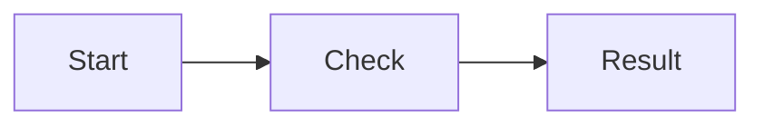

# Fastra Help

Fastra is a native macOS text editor for safe, visually verifiable search
and replace across files and folders. The core idea: **before any bulk
change you see a complete preview** — Fastra never writes to files
without you having seen the effect first.

## Documents and Saving

⌘T opens a new tab. On its first save, Fastra suggests the folder of the file
that was active immediately beforehand — whether you pasted text first or save
the new tab while it is still empty. A folder deliberately selected in the
sidebar takes priority; without document context, the project folder is the
fallback.

“Save As…” adds `.txt` or `.md` to new text and Markdown documents. Its format
menu offers every bundled syntax language plus CSV and XML and changes the
extension when you choose one. You can still type any custom extension directly
in the name field.

## Printing

⌘P prints **what you currently see**. Which version that is depends on the
active view:

- The editor prints the source text with line numbers. Long lines wrap and their
  continuation is indented under the text; nothing is cut off.
- If the Markdown preview sits next to the editor, ⌘P prints the **rendered**
  version with tables, formulas and diagrams — in content exactly what the
  preview shows; the print font size comes from **Settings → Printing**, not
  from the window zoom.
- The hex view prints the visible section as a dump. Unsaved byte changes are
  included, because they are on screen as well.
- Images and SVGs are fitted onto one page; a PDF document prints page by page,
  unchanged.
- A very large text file is shown section by section and therefore printed that
  way too. The header then says which section it is.

For Markdown the choice is explicitly yours: next to “Print…”, the File menu
offers **Print Markdown Preview…** and **Print Source Text…**; ⌥⌘P always
prints the source text. As soon as a document offers more than one version, the
menu item names the one ⌘P will take.

The header carries document name and date, the footer the file path and
“Page n of m”. A page break always falls between two lines, never inside one.
Line numbers and the header/footer can be toggled right in the print dialog
(the “Fastra” section); the preview follows immediately, and the choice is
remembered for the next print job. The same switches plus the print font size
live in **Settings → Printing**; **File → Page Setup…** (⇧⌘P) sets paper size
and orientation.

There is no separate command for printing to a PDF file: the system print dialog
handles that through “PDF” in its bottom-left corner.

## Search and Replace

⌘F opens the search panel in file scope, ⇧⌘F in folder scope; ⌘E uses the
current selection as the search term. If the panel is already open and its
search field is populated, ⌘F and ⇧⌘F only bring it forward — the selected
scope and results stay intact; the menu item “Search in Folders…” always
switches to folder scope. Search runs **live while you type**. The results list
shows the remainder of the line after every match for context; on very long
lines it ends after about 400 characters with “…”. The first 2,000 matches in
the currently visible document are highlighted immediately — in folder and
project scope only while the open tab still matches the searched file version.

**Scopes** (top of the panel):

- **File** — the active tab.
- **Open** — all open tabs (including unsaved ones).
- **Folder** — the enabled folders on disk. Live search starts at
  3 characters; “Search” or Return forces it at any time.
- **Project** — the project folder, narrowed down by file sets and
  exclude patterns.

**Project exclusions:** Separate multiple patterns with commas. A simple dot
suffix such as `.json` is shorthand for `*.json`; explicit globs such as
`userPreferences.*`, `foo?.txt`, and `**` remain unchanged. Matching
directories exclude their complete subtree, while patterns containing a slash
are relative to the project root. Case is respected as entered. `DerivedData`
is always excluded from project searches at any depth and is therefore stated
below the input field. When you change the search term, file type, or
exclusions, Fastra removes the old results immediately; navigation, preview,
and “Replace All” become available again only for the new result.

**Wildcards:** With regex mode off, `*` matches any text **within a
line**, `**` also matches **across line breaks**. Every wildcard
automatically becomes a capture group: the pills (`$1`, `$2` …) below
the replace field can be **clicked or dragged** into the replace field.
Example: search `*, the`, replace `The *` turns “ring, The” into
“The ring”. The always-visible “∗ literal” switch treats `*` as a normal
character. It is enabled only while regex is off and the search expression
contains at least one `*`.

**Regex:** The regex switch enables regular expressions (ICU syntax, as
in `NSRegularExpression`). Capture groups appear as pills as well.
“From example…” derives a pattern from a before/after example; examples with a
literal `*` are ambiguous and are not accepted. Under “Manage Patterns…” you
can save custom regex patterns and import or export them as JSON. Import files
are limited to 1 MB; invalid entries are skipped.

**Options:** case sensitivity, “Whole word”, “Wrap-around”, and
“Selection only” (searches exclusively within the frozen selection).

**Replacing:**

- “Replace” replaces only the active match and moves on.
- “Replace All · N” (⌘Return) replaces every match in the scope.
- “Preview changes” shows every affected line as a before/after diff
  prior to replacing. What gets applied is **exactly** the match set you
  saw — that is a safety guarantee.
- In folder/project scope Fastra rechecks every file against the visible
  preview before the first write. Changed files and affected tabs with unsaved
  edits block the whole operation. Planning, backup and writing run in the
  background with progress feedback; cancelling before the short write phase
  leaves every target file unchanged. A file whose replacement yields exactly
  the same text is skipped — there is nothing to write for it. The operation is
  refused only when not a single file would change.
- Fastra writes atomically per file and creates an automatic backup. “Undo”
  restores only files that were actually changed and stops if any of them was
  edited again after the replace.

**Navigation:** Return or ⌘G jumps to the next match, ⇧⌘G to the
previous one; the arrow keys walk the results list, which scrolls to the
active match. The editor centers the target line as far as the document edges
allow and gives it a stronger colored highlight while the search panel is
open. That line highlight remains visible with a selected match and with
ordinary multiline or rectangular selections; only one active selection line
is emphasized. Escape hides the panel.

## Comparing Files

**Search → Compare Files…** (⌃⌘D) shows two files side by side — no Git
required. Fill the left and right side via the file chooser, drag and
drop, or from open tabs and recently opened files; the active tab
pre-fills the left side.

- **Preselect two open tabs:** First choose the current document tab, then
  Shift-click a second normal text tab. The current tab stays unmistakably
  active with the stronger gray fill; its comparison companion uses a
  softer gray. “Compare Files…” in either selected tab's context menu opens
  the dialog with both documents already selected on the left and right.
  Another Shift-click replaces or removes the companion; a normal tab click
  clears the pair.
- **Options:** trailing whitespace, all whitespace differences, blank
  lines, and letter case can be ignored while comparing. Active options
  are shown in the header of the view.
- **Differences list:** Below the diff, Fastra lists every difference
  (“Lines 12–14 changed”, “Line 30 only on the left”). Clicking jumps
  there; ⌥↑/⌥↓ move to the previous/next difference.
- **Long identical sections** are folded and can be expanded per section.
- **Compare Against Saved Version** compares the unsaved editor content
  of the active tab directly with the state on disk — handy before
  saving.
- Identical files are reported explicitly; binary, missing, or extremely
  large files explain themselves with a clear message instead of a
  misleading diff.

The comparison only displays — it never changes files.

## Text Transformations

All transformations act on the selection — without a selection, on the
whole document. Available from the **Text** menu and the editor’s
right-click menu.

- **Letters:** UPPERCASE, lowercase, Title Case.
- **Whitespace:** remove trailing spaces, tabs → spaces,
  spaces → tabs, indent, outdent, hard-wrap lines…
- **Lines:** sort alphabetically in ascending/descending order, reverse
  lines, remove blank lines, join lines (with/without separator), add
  prefix/suffix to lines…, add/remove line numbers, keep only matching
  lines…, delete matching lines…, keep only duplicate lines, remove
  duplicated lines.
- **Characters:** zap control characters, straighten quotes, educate
  quotes (English), resolve escape sequences, exchange characters,
  exchange words.
- **Unicode:** normalize spaces, strip diacritics, compose Unicode
  (NFC), decompose Unicode (NFD), force or undo emoji presentation
  (U+FE0F).

**Force emoji presentation** appends the variation selector U+FE0F to
characters that only appear in color with it — `⏸` becomes `⏸️`. Afterwards not
just Fastra's editor but also the preview, browsers, GitHub, or Keynote show
the colored symbol. Left untouched: characters that are colored already (🎶),
the textual signs `©`, `®`, `™`, `‼`, and `⁉`, plus `#`, `*`, and digits —
those would turn into symbols. Applying it twice changes nothing further;
**Undo emoji presentation** is the way back.

The visible **Format** control in the footer, **Format Document** in the
**Text** menu, and the editor's right-click menu pretty-print JSON/XML. The
footer control remains visible in text mode and explains that JSON or XML must
be selected first. Also in the menu: **Validate Document** (syntax check with
error position), and **Minify Document**. Formatting and minifying follow the
**effective document format**: automatic mode supports `json`, `xml`, `xsd`,
`xsl`, `xslt`, and `plist`; after manually choosing **JSON** or **XML** in the
language chip, the commands also work in a `.txt` file or an unsaved tab.
Large formatting and minification jobs run in the background and are applied
only while the document and selection remain unchanged. Validation continues
to follow the file extension and additionally covers `svg` and the 4D
container files.

## Go to Target

**Option-double-click** a name to jump to its definition — modeled on
the 4D method editor:

- **4D (`.4dm`):** A method name opens the project method
  (`Project/Sources/Methods/…`), a class name opens the class file;
  `Function` definitions in the current class file jump locally. If
  none of that can be found, Fastra opens the project search with the
  name — never a silent failure.
- **Markdown:** Relative file paths in links/images open in the editor,
  `http(s)`/`mailto` addresses open in the browser, `#anchors` jump to
  the heading in the file.

Option-drag column selection is unaffected (it starts with a single
click). Unresolvable targets respond with a brief flash and a note in
the sidebar.

## Views: Text, Preview, Hex

The switcher on the right side of the footer appears whenever a file
offers more than one view:

- **Text** — the regular editor.
- **Preview** — rendered Markdown, images, PDFs, and SVGs.
- **Hex** — the saved on-disk state of the file as a hex dump; unsaved
  changes of the text tab are not included there. Binary files open
  directly in the hex view, very large text files in a chunked view.

The hex view starts read-only. **Allow Editing** enables input only after a
warning; **Preview & Save…** then shows every planned byte change and asks a
second time. Before the atomic save, Fastra checks the displayed old values
again. If another program has changed any of those bytes in the meantime,
Fastra stops and leaves both the file and the visible change list untouched.
Even very large binary files are processed in bounded chunks in the
background.

## Markdown

For Markdown documents the split view renders a live preview on the right —
automatically for a `.md` file, otherwise as soon as you set the format to
Markdown in the footer's language chip:
tables, code blocks with syntax colors, formulas (KaTeX), and Mermaid
diagrams — fully local, no network access. **Clicking in the preview**
jumps the editor to the matching source line. In the other direction,
**clicking in the source** aligns the preview as closely as possible to the
same place. Copying from the preview yields real rich text (headings, lists,
and bold survive). Copying from the
editor always yields plain text instead: no font, no color, and nothing a
target application can alter while converting.

**Symbols that look narrow in the preview:** Unicode treats some characters as
text characters that only turn into a colored emoji with a trailing variation
selector (U+FE0F) — `⏸`, `⏹`, or `▶`, for example. The editor still shows them
in color because macOS only ships the emoji font for them; the preview follows
the Unicode rule and shows the narrow text form, exactly like browsers, GitHub,
or Keynote. Fastra does not alter the file here. For the symbol to appear in
color everywhere, the variation selector has to be in the text — use
**Text → Force emoji presentation (U+FE0F)** for that.

### Special Preview Syntax

Fastra uses GitHub-Flavoured Markdown and adds the following local renderings
to its preview.

**Visible blank lines:** A source line containing only two or more ordinary
ASCII spaces (`U+0020 U+0020`) appears as exactly one completely empty text
line. In the example below, `␠` represents an ordinary space for clarity; do
not type the `␠` characters themselves:

```text
First paragraph
␠␠
Second paragraph
```

An empty line or exactly one space still follows CommonMark. Two spaces at the
end of a **non-empty** line and a trailing backslash remain ordinary hard
breaks. The extension does not apply inside indented code blocks or code
fences made from backticks or tildes. Copying carries the visible blank line
over as a normal newline.

**Text marker:** Text between pairs of two equals signs is highlighted with a
fixed background that adapts to the light or dark appearance, for example
`==important==`. Other Markdown formatting may be nested inside it; the equals
signs remain literal in inline code and code blocks. This syntax is a Fastra
extension and is not part of standard GFM.

**Formulas (KaTeX):** Put an inline formula between single dollar signs, for
example `$E = mc^2$`. A formula block starts and ends with two dollar signs:

```text
$$
\int_0^1 x^2\,dx = \frac{1}{3}
$$
```

**Mermaid diagrams:** A code fence whose language is `mermaid` renders as a
diagram. Other code fences remain ordinary syntax-highlighted code:

````markdown

````

KaTeX and Mermaid are loaded from the app and run entirely locally; the
preview does not need network access for either feature.

### What the preview does not do

The preview renders a document somebody else wrote — it looks like a harmless
picture of the file, and it is not one. So it never reaches the network:
`default-src 'none'`, remote images are neutralised, local ones are served
through internal tokens. Scripts do not run, and link schemes that execute
rather than navigate (`javascript:`, `vbscript:`, `file:`, `data:`) are
dropped.

Suppressing HTML entirely was not an option: the most common README layout
there is happens to be a centred logo written as
`<p align="center"></p>`. Fastra therefore renders a small, fixed set of
elements — paragraphs, emphasis, lists, tables, `<a>`, ``,
`<details>`/`<summary>` — and rebuilds the output instead of passing input
bytes through.

This is not a given for tools that render Markdown quickly. Two patterns are
common: remote images get loaded as written, which tells whoever sent you the
file that you opened it and roughly when; and formula or diagram libraries are
fetched from a public CDN at display time. Neither is malicious and both are
usually configurable, but they are rarely visible. You can check any tool
yourself: open a document containing a remote image and watch the outbound
connections.

## Writing Markdown

For Markdown tabs, a **format toolbar** appears above the editor; the
same commands live in the “Markdown” menu and the right-click menu. They
act as normal, ⌘Z-undoable text edits on the selection or the cursor
line: bold (⌘B), italic (⌘I), highlight (⇧⌘H), code (⇧⌘K), heading 1–3
(⌘⌥1–3), back to
plain text (⌘⌥0), bulleted list (⇧⌘8), numbered list (⇧⌘7), quote
(⇧⌘9), link (⌘K), and “Insert table…” (a small dialog: columns, header
yes/no).

The toolbar's **Hard Line Break** command inserts two ordinary spaces at the
end of the selection followed by an ordinary line break. If the cursor is
already directly before a line break, it only adds or normalizes the two
spaces. The underlying Markdown stays visible and the edit remains undoable
with ⌘Z.

**Paste Formatted as Markdown** (⇧⌘V) converts HTML or RTF content from
browsers and office apps through the separately installed `md-clip` tool.
Fastra binds the window, tab, editor and selection when conversion starts. If
you switch targets or edit the content while it runs, Fastra stops safely and
does not insert into another document.

**Inserting images:** Pasting an image from the clipboard (⌘V) stores it
as a file in the `images` subfolder
(`documentname-YYYY-MM-DD-hhmmss.png`; PNG/JPEG/GIF keep their format,
everything else becomes PNG) and links it relatively at the cursor position.
**Dragging an image file** keeps its original filename and copies it unchanged
into the same subfolder (name collision → suffix; a byte-identical file is not
duplicated) and links it relatively as well — other files open in a tab as
usual. While dragging, the editor shows the actual text insertion point and
keeps scrolling at the top or bottom edge. After inserting, the preview scrolls
to the insertion point. Unsaved documents have no folder yet — save first (⌘S).

For such a paste or drop, ⌘Z removes both the link and the new image file that
Fastra created; Redo restores both. An existing file or one placed in the file
system and linked manually is never removed.

Fastra publishes an image file only after the copy is complete and never
overwrites a file created concurrently. If the real `images` folder is
replaced with a symbolic link while copying, the operation stops and writes
nothing to the link target.

### HTML in the Preview

Markdown files often contain some HTML — most commonly a centered image at the
top of a README. The preview shows a deliberately small selection of it:
paragraphs, text emphasis, lists, tables, links, images, and
`<details>`/`<summary>`.

Everything else is silently left out, including `<script>`, `<style>`,
`<iframe>`, and `<svg>`, as well as all event attributes and the `style`,
`class`, and `id` attributes. A foreign file therefore cannot execute anything
in the preview, cannot load anything, and cannot lay itself over the display.
If any detail of an HTML section does not fit this narrow grammar, the whole
section is dropped — visibly too little beats unnoticed too much.

Images from such HTML sections are treated like Markdown images: local files
appear, remote addresses are not loaded. Opening a Markdown file still produces
no network traffic.

## Converting Documents to Markdown

When the separately installed **Poor Man's Text** tool is present, Fastra can
convert whole documents to Markdown. Opening a recognized file — depending on
the tool's version, for example `.rtf`, `.rtfd`, `.docx`, `.odt`, or `.doc` —
shows a **Convert to Markdown** hint above the editor. The same command is in
the **File** menu and in the project sidebar's context menu. Fastra never
converts on its own: choosing the command is your consent.

Only one conversion runs across the app at a time. A second window keeps its
own offer visible, explains that another conversion is active, and disables
the action until that conversion finishes.

An `.rtfd` document is a folder in Finder. Fastra therefore asks whether to
convert it or open it as a folder — both when opening it and when clicking it
in the project sidebar.

**Where the result goes:** right next to the original. If only text was
produced, as `Name.md`. If images were extracted as well, as a folder `Name`
containing `Name.md` and an `images` subfolder. If that name is already taken —
for example because `Report.rtf` and `Report.docx` sit side by side — Fastra
falls back to `Report-2`. Existing files are never overwritten, and the original
document stays unchanged.

The conversion is deliberately lossy: Markdown can keep structure, links, simple
emphasis, lists, and images, but not every font and no layout. When the tool
reports such losses, they appear in the bar above the editor afterwards.

**Which formats are offered** is something Fastra asks Poor Man's Text at
launch, remembering the answer for five minutes. If the tool later supports more
formats, Fastra uses them without an update of its own — if you just updated it
and do not want to wait, restart Fastra. When the tool itself is missing,
nothing is offered. When it is installed but a helper it needs (usually Pandoc)
is missing, Fastra says so: the bar above the editor — or the `.rtfd` folder
prompt — explains what is missing. You can install Pandoc in Terminal with
`brew install pandoc`, then restart Fastra.

## Languages and Syntax Colors

Fastra detects the language from the file extension, and for files
without one, from the content. The language chip in the footer opens the
language menu: a manual choice always beats the automatics;
“Automatic” returns to them.

Fastra remembers a manual choice **per file**. The next time you open that
file it comes back in the same format — which matters most for files without
an extension, where the automatics have nothing to go on. “Automatic” drops
the remembered entry again. Renaming and “Save As” carry the entry over to
the new path.

The choice also drives the Markdown features: set a file to **Markdown** and
the preview opens along with the format toolbar; switch to another format and
the preview closes again.

## Soft Wrap

The compact **Soft Wrap control** sits in the footer next to the language
chip. It visibly shows **On** or **Off**; clicking the main control toggles
it immediately. The separate arrow and a right-click open the same options.
**View → Soft Wrap** (⇧⌘L) toggles the same value.

Soft Wrap is stored **per effective document format** and applies
application-wide to every open and later-opened document of that format.
A manual language choice therefore also selects the format profile. In the
options menu, “Reset … to Factory Default” removes only the custom override
for the current format.

The available **wrap targets** are the window width, the page guide, and a
fixed column. Fixed-width presets are 72, 80, 100, and 120; a custom value
can be entered from column 20 through 500. Choosing a target also turns
Soft Wrap on. If the window is narrower than the chosen target, wrapping
falls back to the window edge.

The **page guide** can be shown independently through the Soft Wrap options,
**View → Show Page Guide**, or **Settings → Editor**. Its app-wide column
is configured there as well and defaults to 80. Fastra prefers word
boundaries when wrapping. A single long word falls back to character
boundaries without splitting a Unicode character.

The factory default is on for **Plain Text, JSON, Markdown, HTML, and XML**. It
is off for **4D, CSV, and other code/configuration formats**. A `.txt` file
without a saved custom override therefore opens with Soft Wrap at the window
edge. This remains true when JSON is remembered as its format. Even a
multi-megabyte document containing one logical line can be opened, scrolled,
and edited with Soft Wrap; Fastra keeps editor views only for the visible
portion. There is no automatic suspension or lockout. With Soft Wrap off, long
lines remain reachable through the horizontal scroll bar.
Toggling it changes neither text nor selection, undo history, or the saved
file. The topmost displayed text line remains steadily anchored in place.

## Indentation

The same options menu carries the format's **indentation profile**: the Tab
key inserts either a **tab** or **2, 3, 4, or 8 spaces**, and the **tab
width** controls how wide a tab character is displayed. The factory default
is four spaces with a tab width of four. Like Soft Wrap, this profile is
stored **per document format**, applies immediately to all open documents,
and survives restarts; “Reset … to factory default” removes it as well.

The same profile drives **Shift Right/Shift Left** (Text menu and right
click), **Detab/Entab**, and the automatic indentation after Return.
Changing the profile **never** reformats existing text automatically — it
takes effect with the next keystroke or command.

**Edit → Paste and Match Indentation** (⌥⇧⌘V) inserts the clipboard text so
it sits on the target line's indentation: the block's common base
indentation is removed, the relative nesting is preserved, and the result
is expressed in the active profile's tabs or spaces. If the target line is
empty, the most recent non-empty line above it counts. Blank lines in the
block stay blank, the document's line-ending style is preserved, and the
whole insertion is a single undo action. With an active column or
multi-range selection the command visibly explains that it does not apply
there.

## Column Selection

**Option-drag** selects the same column range across multiple **logical text
lines**. This also works with Soft Wrap: a long line remains exactly one
rectangle row even when it is displayed as several wrapped fragments. Short
and empty lines, tabs, CRLF, and composed Unicode characters are not split
artificially.

**Copy, cut, delete, typing, and normal paste** operate on every part. One
clipboard line fills every rectangle row; multiple clipboard lines are
distributed in order. If the clipboard has fewer lines, the remaining
rectangle parts are cleared. Extra lines continue below the rectangle. Each
multi-part edit is fully undone with one ⌘Z.

**Edit → Paste Column** (`⌃⌘V`) is also available in the right-click menu.
It pastes clipboard lines vertically at the rectangle's left edge or, without
a rectangle, at the cursor. Short target lines are padded to the target
column; whole tab stops use tabs when the active indentation profile uses
tabs, with any remainder kept as spaces.

**Select Column Up/Down** (`⌃⇧↑/↓`) grows or shrinks a rectangle by one
logical line. Character operations such as case, quote, and Unicode
transformations process every rectangle part independently. Commands that
operate on whole lines or may create line breaks are disabled during a
column selection and explain why, so nothing outside the visible rectangle
is changed.

## 4D Support

`.4dm` methods are rendered with a dedicated 4D color scheme (commands,
keywords, variables, comments like in the 4D editor). In an open project,
Fastra also recognizes methods in `Project/Sources/Methods` case-insensitively
and highlights them distinctly from process variables. Shared component
methods are orange and bold, so they remain distinct from project methods and
ordinary commands after accepting a typeahead suggestion; `[Table:1]` remains
a table. Via the language menu, 4D can also be enabled manually for other files.
`.4DProject`/`.4DForm` are real JSON files, `.4DCatalog`/`.4DSettings`
real XML — they open with JSON or XML rendering.

**Completion:** In `.4dm` methods, Fastra suggests commands (with their
syntax signature), the open project's methods, shared methods of the
project's components (labeled with the component name), and constants
after two typed characters — Esc or ⌃Space also opens
the list manually, ↑/↓ select, Return/Tab accepts, Esc closes. The
names, signatures, and command numbers come from the official 4D
documentation (CC BY 4.0, © 4D SAS — see the third-party notices).

**Parameter help:** When the cursor is inside the parentheses of a project
method call, a small panel below the line shows the method's signature —
the parameter the cursor is currently in is highlighted, and the method's
header comment appears underneath. The opening parenthesis is enough; with
a closing parenthesis the help applies anywhere in between. Fastra reads
the method's `.4dm` file directly: both
`#DECLARE($name : Type; …)->$result : Type` and classic
`C_TEXT($1;$2;…)` declarations (only `$N` are parameters, `$0` is the
return value). For built-in 4D commands the signature comes from the
bundled command list. Nested calls follow the cursor: inside the inner
method's parentheses its signature applies, behind them the outer one again.

**Components:** Fastra also knows the shared methods of the components
under `Components/` — from unpacked `.4dbase` folders as well as from
`.4DZ` archives, which do not need to be extracted for this. For compiled
components without source code, Fastra uses the bundled method
documentation as the signature source; if that is missing too, the method
only appears in the typeahead, without invented parameters (the panel then
shows `(…)`). If a project method has the same name as a component
method, the project method wins in both typeahead and highlighting.

**Checking `.4DForm`:** “Text → Check Document” additionally validates
form files against the bundled form schema (MIT-licensed, by Mathieu
Ferry) and jumps to the offending spot including its JSON path.

**Export transformation:** The **Text** menu strips token suffixes of
canonical 4D exports (`ALERT:C41` → `ALERT`, also `:Knn:mm`) or re-adds
command tokens. No public source lists constant numbers — “Add command
tokens” therefore honestly leaves constants unchanged.

**Structure hints:** “Text → Check Document” inspects `.4dm` methods
heuristically for block balance (`If/End if`, `For each/End for each`,
`Case of/End case`, `Repeat/Until`, `While/End while`, `Function`
blocks) plus bracket, string, and comment balance, and jumps to the
spot. Honestly put: a heuristic, not a compiler replacement — tool4d
checks authoritatively (next section).

## 4D and tool4d

Fastra can check 4D code for syntax diagnostics with **tool4d**, 4D’s
lightweight headless runtime. According to 4D it is free and requires no
license. Fastra deliberately does not bundle it, downloads nothing, and
starts no installation.

**Getting tool4d** — one source is enough:

- **4D download page:** <https://product-download.4d.com> — download and
  unpack the “tool4d” package matching your 4D version.
- **VS Code extension “4D-Analyzer”** (publisher “4D”): downloads tool4d
  automatically; on the Mac it lives under
  `~/Library/Application Support/Code/User/globalStorage/4D.4d-analyzer/tool4d/…/tool4d.app`.

**Help → Find tool4d…** checks these known locations (plus PATH and the
Applications folders), shows the location and version, and remembers the
path. In the Applications folders any bundle whose name starts with
"tool4d" counts — versioned downloads such as `tool4d_v21_nightly_….app`
do not need to be renamed. If several are present, Fastra picks the
highest version.

**Your own tool4d path:** Settings under “4D” lets you enter the executable
directly; `~` is allowed. Only an EMPTY field means “Fastra searches by
itself”. If an entered path points nowhere, at a folder, or at something not
executable, the field says so right away — Fastra does NOT silently fall back
to some other installation it happens to find.

**Check Document:** When a saved `.4dm` method belongs to an open 4D project
and tool4d is available, **Text → Check Document** starts a short local LSP
check. Fastra listens only on `127.0.0.1`, tool4d connects to it, and both
connection and process are closed after the result. When tool4d supplies a
non-`null` diagnostic report, errors include line and column and you can jump
to the first one. A `null` report is an explicit "no usable result", never a
clean check. A safe-project probe with tool4d 21.1 verified a full diagnostic
report and shutdown; an earlier `null` was the macOS `/tmp` alias, so Fastra
canonicalizes document and workspace URIs. Without tool4d or a matching
project, the explicitly heuristic structure hints remain available; they are
not a compiler replacement.

**Manual headless check:** tool4d works per project (always the
`.4DProject` file, never a single method). The most reliable full check
runs in compiled mode:

```
…/tool4d.app/Contents/MacOS/tool4d \
  --project "Path/to/Project/Project/MyProject.4DProject" \
  --opening-mode=compiled --dataless --skip-onstartup
```

Errors appear on the console; a non-zero exit code means problems.

## 4D Macros

For `.4dm` files, Fastra offers the macros of the 4D method editor (the
“Macros” menu). It finds every “Macros v2” XML file that 4D itself would
load, relative to the 4D project of the open file:

- in the project's components (`Components/….4dbase/Macros v2`, from 4D v21
  `….4dbase/Contents/Macros v2`, plus packages linked via
  `Project/Sources/dependencies.json`),
- per user under `~/Library/Application Support/4D/Macros v2`,
- in the installed 4D.app itself (language-specific `Macros.xml`; with
  several versions the highest wins).

**Text macros** (such as `If`/`While` or your own insertion macros) are
applied by Fastra directly: placeholders like `<method_name/>`,
`<selection/>`, date/time and user are substituted, `<caret/>` positions the
cursor. The insertion is a normal, undoable step. Fastra supports date formats
0–8 and time formats 0–6 from the 4D macro definition; an unknown format
number or placeholder tag is explained instead of being silently substituted
differently. A menu item's tooltip identifies its source (component, user
macro folder, or 4D version), so identically named macros remain distinguishable.

**The completion family** (`MAO_MethodeKomplettierenNeu` and its variants)
runs headless through tool4d against an engine project providing the
`MacroRun` startup method; its folder is set in Settings under “4D”. The
result always appears as a diff preview first; “Apply” is a single undo step
and only takes effect while the document still matches the previewed state
exactly. Token suffixes (`:C41`, `:K5:70`) are preserved: Fastra detokenizes
before the run and restores the suffixes from the original. `00_DM_Info` and
`Compiler_*` methods are deliberately excluded from completion.

**Shortcuts:** A `/x` suffix in a macro name (such as “… /#”) becomes ⌘#.
An existing application menu command always wins. A macro using the same key
therefore shows no shortcut and remains available through the menu. The same
rule applies after the first macro when several sources assign the same key;
only the first one loaded keeps it. A macro shortcut also counts as handled
only when the macro actually starts or inserts text.

**Limits:** Macros that need the clipboard, editor selection through 4D
methods, or the host project (such as the FileMerge and sort macros) only
run inside the real 4D method editor. Fastra lists them in the menu and
explains on invocation why they cannot run here. The same applies to a macro
containing a placeholder tag Fastra does not know: it would otherwise
silently insert incomplete text.

## XPath Bar

For XML-like documents, ⇧⌘X shows the XPath bar: type an XPath query,
Fastra counts the matches and jumps to them in the document as you
navigate. With incomplete or invalid XML, navigation waits for the document to
become valid again so stale source positions cannot trigger a jump.

## Project and Sidebar

When you open a single file, the sidebar automatically shows the
matching folder — if the file lives in a Git repository, its root
folder. With tabs from different Git repositories, this context always follows the
active file tab, including after closing the previously active tab; deeply
nested and untracked files do not change that rule. The sidebar header shows
the project name (tooltip: full path);
**⌘-click the name** for a menu of neighboring folders to switch
projects quickly, and the right-click menu offers “Show in Finder” and
more. **⌘-click a document tab** shows the file’s macOS path menu. The
file tree can create, rename, and trash files and folders.
It can also duplicate an item: the copy gets “copy” and, when needed, a running
number before its extension and opens immediately as the active tab. A saved
tab's right-click menu contains the same file actions; options that need a file
stay disabled on an unsaved tab. On wide windows, the sidebar can be expanded
to 760 points so long paths remain readable.

**Filtering files:** The filter field above the file tree filters live
by file name (substring, case-insensitive — deliberately no fuzzy
matching). Matches appear with their parent folders expanded; everything
else is hidden, and the counter shows “N of M files”. Escape or the X
clears the filter and restores the previous expansion state. The filter
only searches NAMES — for contents, use “Find in Folders…” (⇧⌘F, also
offered as a link when the filter finds nothing).

## Git

If the project is a Git repository (and `git` is installed), the sidebar
additionally shows the **Changes** and **Graph** tabs:

- Branch row with branch switching, fetch, and separate ahead/behind counts for
  every remote. In the graph, shape and colour distinguish local branches from
  remote branches, and each remote keeps its colour.
- **Changes:** stage/unstage files, discard, and commit right from the
  sidebar. After a local commit, the Commit button becomes a Push button:
  every locally configured remote gets its own fully clickable surface with
  its name and effective push address; two targets sit side by side at regular
  widths. While the push runs, a spinning indicator turns inside the card;
  after success it shows a green checkmark for two seconds, and errors appear
  as a dialog with the real Git message.
  Fastra explicitly pushes only to the clicked target and always leaves
  upstream configuration unchanged, including when the branch has no upstream.
  Push and pull run asynchronously.
  Before pushing, Fastra fetches the remote state and shows the address, target
  ref, source commit, and the local and missing commits. If that basis changes
  before execution, nothing is transferred. Divergence and rejected
  non-fast-forward pushes get an explanation; force-with-lease remains a
  separately confirmed follow-up. The standalone force-push command in the
  graph also shows the effective address and binds execution to that confirmed
  state. Multiple effective push addresses for the
  same remote or Git
  rules that rewrite addresses through `insteadOf`/`pushInsteadOf` are
  ambiguous and stop with an explanation. If only one remote cannot be read,
  the other push targets remain available and the actual Git message appears
  as a warning.
- **Several files at once:** in the file list, a click selects one row,
  opens it as a temporary preview, ⇧-click selects the range up to it, and
  ⌘-click adds or removes
  individual rows. Selected rows have a colored background. An action on a
  selected row — discard, stage, or unstage, via button or context menu —
  then applies to the whole selection; the context menu states the count.
  Discarding asks once for all affected files, and the prompt explicitly
  says how many of them are untracked files (those get deleted). When Git
  reports a whole untracked folder as one row, Fastra does not delete it
  recursively, so ignored files inside remain untouched.
- **List or folder tree:** the folder button in the first section header
  switches between the compact flat list and an expandable tree. The tree uses
  the same folder symbols and disclosure controls as the Files tab. Fastra
  remembers the choice for the next launch.
- **Quick file inspection:** a single click opens an italic temporary preview
  tab; the next single click replaces it. A double click keeps the tab open,
  as does the first edit. Deleted files are struck through in the list. A click
  opens their previous Git version in a read-only editor; a red tab title and
  lock show the state, and an edit attempt explains it right at the insertion
  point. The diff remains available through “Show Changes (Diff)” in the
  context menu.
- **Bulk buttons in the “CHANGES” section header:** open a combined diff of
  all open changes in the two-column view, discard all changes, stage
  everything. The “STAGED” header has the button that unstages everything.
  Section headers stay pinned while you scroll, so the title and the buttons
  remain reachable with many files; in a narrow sidebar the title is
  truncated first, never a button.
- **Graph:** the commit graph with branches and merges.
- History (`git log`) and diffs open as read-only tabs; clicking a
  commit hash shows its details.
- Git diffs use the same two-column view as **Compare Files** —
  including the differences list at the bottom and ⌥↑/⌥↓ navigation
  (⌥⌘[/⌥⌘] still work). Both columns always have the same width; lines
  longer than one column wrap inside their column so nothing is cut off.
- Merge conflicts get a dedicated bar with safe resolution steps.

Fastra remains a thin frontend over the installed `git` — destructive
operations require a visible confirmation.

## Encoding and Line Endings

The footer shows the encoding and line ending of the active tab:

- **Encoding chip:** “Reopen with encoding” reloads the file from disk
  with a different encoding.
- **Line-ending chip:** choose LF, CRLF, or CR — the change takes
  effect on the next save.

UTF-32 files with a BOM are recognized in both byte orders. For older text
files without a BOM, Fastra distinguishes Windows-1252 characters such as
typographic quotes and the euro sign from Latin-1. If the format cannot be
handled safely, the file stays unchanged.

If an open file was changed outside Fastra, returning to the app prompts when
the tab has unsaved edits; a clean tab reloads the new on-disk version silently.
This also works when an external tool preserves the modification date or sets
it to an older value. Saving likewise asks for explicit confirmation. A
further change immediately before the write always cancels the save instead
of silently overwriting the on-disk version.

## Windows and Tabs

⌘T opens a new tab, ⌘N a second, fully independent window (its own
tabs, its own search). A new window adopts the size of the frontmost one;
with no window open it starts tall enough to actually use the screen. You can
always drag it smaller — a size you choose yourself is kept. ⌘S saves, ⌘W
closes the tab in the window that has keyboard focus; a document window in the
background is never used as a substitute. Fastra asks first if there are
unsaved changes. While Help, Settings, or About Fastra is in front, Save,
Search, match navigation, text, and Git commands likewise leave background
documents untouched. After closing, the most recently used tab
becomes active; several freshly created empty tabs can thus be closed
again with repeated ⌘W in reverse order, without an older document
getting hit. ⌘J jumps to a line number.

Switching tabs keeps each tab's insertion point **and** its visible section:
switching back shows the text exactly where you left it. A deliberate jump — a
search hit or ⌘J — takes precedence and scrolls to the target as usual.

After opening or closing a document and on every tab switch, the tab bar scrolls
until the active tab is fully visible. Between those changes, a horizontal
position you chose manually is left untouched. The tab's right-click menu also
offers Save, Close This Tab, and Close Other Tabs. Tab titles always show the
full file name; with many or long names, the bar scrolls horizontally. Active
and inactive tabs use clearly different surfaces and borders.

A dot in the tab indicates unsaved changes. It disappears again as soon as
the content exactly matches the saved state — whether via Undo or by
manually reverting your edits. After saving, the new state becomes the
comparison baseline.

The Home button at the top left returns the current window to the welcome
screen. Clean tabs are closed. If unsaved content exists, an initial prompt
first confirms only the overall transition; cancelling leaves the workspace
completely untouched. Only after confirmation does Fastra ask to save each
affected file. Cancelling there keeps the project and tabs open.

The welcome screen is not a tab of its own but a starter overlay that sits on
top of every fresh, untouched empty tab — like a browser's new-tab page. The
cursor is already waiting in line 1; the first typed character dismisses the
overlay. A fresh ⌘T tab shows it again, as does a new tab in a window with a
loaded project. An untouched empty tab is cleaned up automatically when you
open a file.

Anything can be handed to Fastra from outside: “Open With → Fastra”, a drop on
the Dock icon, or `open -a Fastra …` in a terminal accept files of any kind and
folders as well — a folder is loaded as a project. Fastra offers itself for every
file type but never makes itself the default app, so double-click assignments
stay as they are.

When you open a file from the Finder, it lands in the window whose project
or repository contains it, and that window comes to the front. If no window
fits, Fastra uses an empty window (such as the welcome screen); if there is
none, it opens the file in a new one. If this action launches Fastra, the saved
session is restored first and the explicitly opened file is then added.

By default, Fastra restores the last project windows, saved documents, active
tabs, and window positions on the next launch. Windows without open files are
not restored: once you have closed every tab, the next launch greets you with
the welcome screen again. You can turn this off under
**Settings → Startup**. Contents of unsaved or untitled documents are never
stored or restored. With session restoration disabled, a Finder launch opens
only the explicitly requested file.

Shift-clicking a second normal text tab marks both for file comparison
without switching the current tab. The current tab keeps the stronger
highlight and the companion uses a softer one; a normal click clears the
pair.
